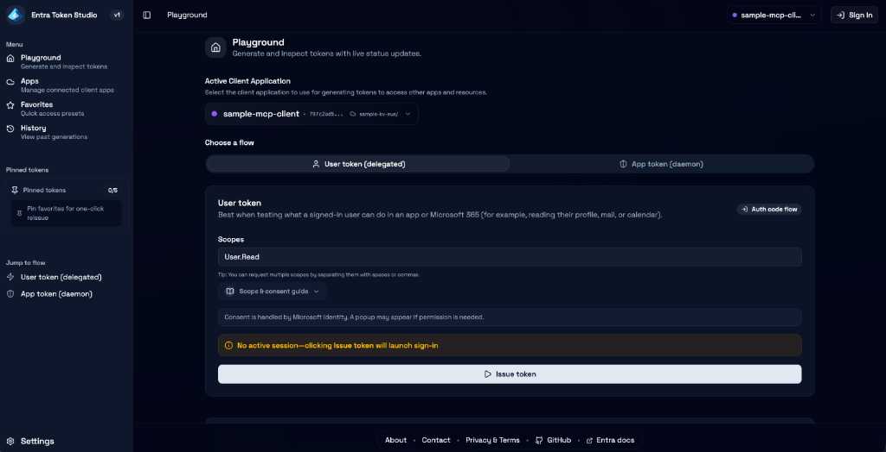
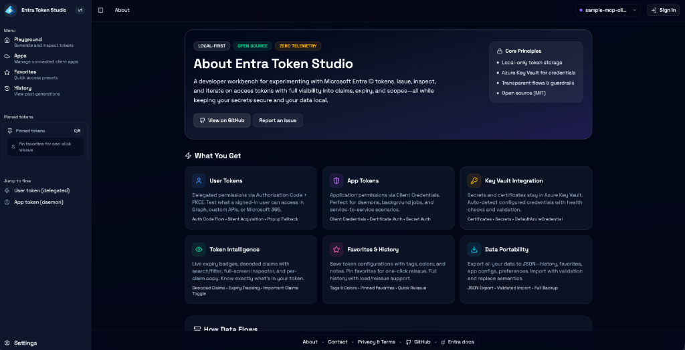

# Entra Token Studio

**A local developer workbench for generating, inspecting, and testing Microsoft Entra access tokens.**

Built with SvelteKit 2, Svelte 5, TypeScript, shadcn components, MSAL, and Azure SDKs.

[](LICENSE)

<div align="center">

**Local-First** · **Open Source** · **Zero Telemetry**

</div>

> ⚠️ **Local-only, developer-supervised use.** This app handles real credentials and live access tokens. Run it on your own machine, keep browser storage under your control, and never deploy it as a shared or multi-user service.




---

## Why This Project Exists

### The Problem

If you've worked in an enterprise environment with Microsoft Entra ID (formerly Azure AD), you've likely experienced this:

1. **Azure Portal is powerful but overwhelming.** Entra provides enterprise-grade identity management, but the sheer number of features makes day-to-day developer tasks—like testing if "App A can talk to App B"—surprisingly difficult to discover and navigate.

2. **No quick way to generate tokens.** Azure Portal lets you create app registrations and configure credentials (secrets/certificates), but there's no built-in way to quickly issue OAuth tokens for testing. Developers resort to:
   - Writing one-off PowerShell or Python scripts
   - Using curl with manually constructed token requests  
   - Copying tokens from browser DevTools
   - Asking colleagues for "that script someone wrote"

3. **Testing identity integration is cumbersome.** After completing onboarding with API B's team, you want to quickly verify that your App A can actually call API B before wiring up the full integration code. But generating that first test token requires navigating OAuth complexity, Entra's specific configuration, and often scattered internal documentation.

4. **Knowledge silos everywhere.** Teams create individual TSGs (Troubleshooting Guides), siloed scripts, and ad-hoc workflows. When production issues occur and you need to validate an API's behavior using your app's identity, developers scramble to find "how do I get a token for this again?"

### The Solution

**Entra Token Studio** bridges the gap between Azure Portal's app configuration and your daily development workflow:

```
┌─────────────────────────┐         ┌─────────────────────────┐
│      Azure Portal       │         │   Entra Token Studio    │
│  (App Registration &    │  ───▶   │  (Day-to-Day Testing &  │
│   Credential Setup)     │         │    Token Generation)    │
└─────────────────────────┘         └─────────────────────────┘
```

**Use Azure Portal** for initial setup: creating app registrations, configuring permissions, setting up certificates and secrets in Key Vault.

**Use Entra Token Studio** for daily work: generating tokens quickly, testing APIs before full integration, debugging authentication issues during live-site incidents, and replacing scattered scripts with a centralized workflow.

### Who This Is For

- **Backend developers** who need app-to-app tokens (client credentials) to test their APIs
- **Frontend developers** who need user tokens (delegated permissions) to test authenticated endpoints
- **Platform engineers** troubleshooting production identity issues
- **Anyone** tired of writing custom scripts just to generate an OAuth token

---

## Features

| Feature | Description |
|---------|-------------|
| **Multi-App Workspace** | Configure multiple Entra app registrations, switch between them with a dropdown, and keep per-app colors, tags, and notes |
| **App Tokens** | Server-side client credentials flow supporting Azure Key Vault certificates and secrets |
| **User Tokens** | Browser-side Authorization Code + PKCE via MSAL.js with silent acquisition and popup fallback |
| **Token Intelligence** | Live expiry badges, floating token dock, full-screen inspector, decoded claims search/filter, and per-claim copy |
| **Favorites & History** | Save frequently used configurations with tags/colors/descriptions; pin up to 5 favorites for one-click reissue |
| **Smart Suggestions** | Quick-pick inputs for scopes/resources sourced from favorites, history, and built-in Graph/Azure presets with admin-consent badges |
| **Data Portability** | Export/import all local data (history, favorites, app configs) with security acknowledgments and validation |
| **Theme Support** | Light, dark, and system theme options |

---

## Prerequisites

Before using Entra Token Studio, you need:

### 1. Development Tools

| Tool | Version | Installation |
|------|---------|--------------|
| **Node.js** | 18+ (LTS) | [nodejs.org/en/download](https://nodejs.org/en/download/) |
| **pnpm** | Latest | `npm install -g pnpm` |
| **OpenSSL** | Any | Usually pre-installed on macOS/Linux; [Windows install guide](https://slproweb.com/products/Win32OpenSSL.html) |

> **Why OpenSSL?** Modern PKCS#12 certificates (like Azure Key Vault self-signed certs) use AES-256-CBC encryption that requires OpenSSL CLI as a fallback when the pure-JS parser can't handle them.

### 2. Azure Identity Access

You need a way to authenticate to Azure for Key Vault access. Choose one:

| Method | Best For | Setup |
|--------|----------|-------|
| **Azure CLI** | Terminal-focused workflow | [Install Azure CLI](https://learn.microsoft.com/en-us/cli/azure/install-azure-cli) → Run `az login` |
| **VS Code Azure Extension** | VS Code users | Install [Azure Account extension](https://marketplace.visualstudio.com/items?itemName=ms-vscode.azure-account) → Sign in via Command Palette |
| **Managed Identity** | Azure-hosted environments | Automatically available if running on Azure VMs, App Service, etc. |

The studio uses [`DefaultAzureCredential`](https://learn.microsoft.com/en-us/javascript/api/@azure/identity/defaultazurecredential) which automatically discovers your credentials in this order.

### 3. Azure Portal Setup (One-Time)

#### Step A: Create or Configure Your App Registration

1. Go to [Azure Portal](https://portal.azure.com) → **Microsoft Entra ID** → **App registrations**
2. Click **+ New registration** (or select an existing app)
3. Configure the app:
   - **Name**: A descriptive name for your app
   - **Supported account types**: Select based on your needs (usually "Single tenant")
   - **Redirect URI**: Add `http://localhost:5173/auth/callback` as a **Single-page application (SPA)** redirect

   > **Important:** The redirect URI must be registered as a SPA type, not Web. This enables the PKCE flow for user tokens.

4. Note down:
   - **Application (client) ID** — found on the Overview page
   - **Directory (tenant) ID** — found on the Overview page

📚 [Microsoft Docs: Register an application](https://learn.microsoft.com/en-us/entra/identity-platform/quickstart-register-app)

#### Step B: Set Up Credentials in Azure Key Vault

**Option 1: Using a Client Secret**

1. In your app registration → **Certificates & secrets** → **Client secrets** → **+ New client secret**
2. Copy the secret value (you won't see it again!)
3. Go to your [Key Vault](https://portal.azure.com/#view/HubsExtension/BrowseResource/resourceType/Microsoft.KeyVault%2Fvaults) → **Secrets** → **+ Generate/Import**
4. Name it (e.g., `my-app-secret`) and paste the client secret as the value

**Option 2: Using a Certificate (recommended for production)**

1. In your Key Vault → **Certificates** → **+ Generate/Create**
2. Create a self-signed certificate or import your own
3. In your app registration → **Certificates & secrets** → **Certificates** → **Upload certificate**
4. Upload the public portion of your Key Vault certificate (download as CER from Key Vault)

📚 [Microsoft Docs: Key Vault certificates](https://learn.microsoft.com/en-us/azure/key-vault/certificates/about-certificates)

#### Step C: Grant Key Vault Access

For Entra Token Studio to fetch your credentials:

1. Go to your Key Vault → **Access control (IAM)** → **+ Add role assignment**
2. Assign one of these roles to your identity (the account you'll use with `az login` or VS Code):
   - **Key Vault Secrets User** — for client secrets
   - **Key Vault Certificates User** — for certificates  
   - **Key Vault Administrator** — for both (broader access)

📚 [Microsoft Docs: Assign Key Vault access](https://learn.microsoft.com/en-us/azure/key-vault/general/rbac-guide)

#### Step D: Configure API Permissions (if needed)

If you're calling specific APIs (like Microsoft Graph):

1. In your app registration → **API permissions** → **+ Add a permission**
2. Select the API and add the required permissions
3. If permissions require admin consent, click **Grant admin consent for [your tenant]**

📚 [Microsoft Docs: Configure permissions](https://learn.microsoft.com/en-us/entra/identity-platform/quickstart-configure-app-access-web-apis)

---

## Quickstart

### Terminal-Focused Workflow

```bash
# 1. Clone and install
git clone https://github.com/raokarthik99/entra-token-client.git
cd entra-token-client
pnpm install

# 2. Set up environment
cp .env.example .env
# Edit .env if you need to change the port (default: 5173)

# 3. Sign in to Azure (for Key Vault access)
az login

# 4. Start the dev server
pnpm dev
```

Open [http://localhost:5173](http://localhost:5173) in your browser.

### VS Code Workflow

1. **Clone the repository**
   ```bash
   git clone https://github.com/raokarthik99/entra-token-client.git
   cd entra-token-client
   code .
   ```

2. **Install dependencies**
   ```bash
   pnpm install
   ```

3. **Set up environment**  
   Copy `.env.example` to `.env`

4. **Sign in to Azure**  
   Open Command Palette (`Cmd/Ctrl + Shift + P`) → **Azure: Sign In**

5. **Start the dev server**
   ```bash
   pnpm dev
   ```

Open [http://localhost:5173](http://localhost:5173) in your browser.

### First Run: Connect Your App

On first visit, you'll be redirected to the **Apps** page with a guided onboarding experience:

1. Click **Connect Your First Client App**
2. Fill in:
   - **Tenant ID** — from your app registration
   - **Client ID** — from your app registration
   - **Key Vault URI** — e.g., `https://your-vault.vault.azure.net`
   - **Credential Name** — the name of your secret or certificate in Key Vault
   - **Credential Type** — Secret or Certificate
3. The app validates Key Vault connectivity before saving
4. You're ready to generate tokens!

---

## How Token Flows Work

### App Tokens (Client Credentials)

For server-to-server / app-to-app authentication:

```
┌─────────────────┐      ┌─────────────────────┐      ┌─────────────────┐
│  Entra Studio   │ ───▶ │  Your Key Vault     │ ───▶ │   Entra ID      │
│  (Browser)      │      │  (Secret/Cert)      │      │   (Token)       │
└─────────────────┘      └─────────────────────┘      └─────────────────┘
        │                                                      │
        │◀──────────────────── Access Token ───────────────────│
```

- Server-side client credentials flow using `@azure/msal-node`
- Credentials are fetched from Key Vault at runtime—never stored locally
- Authentication method is auto-selected: Key Vault certificate → local certificate → Key Vault secret → local secret
- The `/.default` scope is automatically appended to resources

### User Tokens (Delegated Permissions)

For user-context authentication:

```
┌─────────────────┐      ┌─────────────────────┐      ┌─────────────────┐
│  Entra Studio   │ ───▶ │  Entra ID Login     │ ───▶ │   Consent       │
│  (Browser)      │      │  (Popup/Silent)     │      │   (if needed)   │
└─────────────────┘      └─────────────────────┘      └─────────────────┘
        │                                                      │
        │◀──────────────────── Access Token ───────────────────│
```

- Client-side Authorization Code + PKCE flow using `@azure/msal-browser`
- Silent acquisition is attempted first
- Falls back to popup if consent or account selection is needed
- Tokens are decoded client-side and never logged

---

## Everyday Use

### Generating Tokens

1. **Select your app** from the Playground dropdown (if you have multiple)
2. **Choose token type**:
   - **User Token** — for delegated permissions (on behalf of a user)
   - **App Token** — for client credentials (app-to-app)
3. **Enter resource/scopes**:
   - Use the smart suggestions that surface your favorites, history, and common presets
   - For app tokens: enter the resource URI (e.g., `https://graph.microsoft.com`)
   - For user tokens: enter specific scopes (e.g., `User.Read`, `Mail.Read`)
4. **Issue the token** and see decoded claims instantly

### Staying Organized

- **History** — All token requests are saved with full context; use Load to view details or Reissue to regenerate
- **Favorites** — Save commonly used configurations with friendly names, tags, and colors
- **Pinned Favorites** — Pin up to 5 favorites to the navigation for one-click reissue

### Token Inspection

- **Status Badges** — Real-time indicators for valid, expiring, and expired tokens
- **Floating Dock** — Quick access to your active token
- **Full-Screen Inspector** — Deep dive into decoded claims with search and filter (press ESC to close)
- **Per-Claim Copy** — Click any claim to copy its value
- **Important/All Toggle** — Filter claims to show important ones or all

### Data Management

- **Export** — Download all local data (history, favorites, app configs) as JSON with security acknowledgments
- **Import** — Restore data with validation and preview
- **Clear Data** — Selectively clear history, favorites, or all data from Settings

---

## Data Boundaries & Security

| Data Type | Storage Location | Notes |
|-----------|------------------|-------|
| **Tokens & History** | Browser IndexedDB | Local only; never leaves your machine |
| **Favorites & Preferences** | Browser IndexedDB | Local only |
| **App Configurations** | Browser IndexedDB | Stores IDs and metadata only |
| **Credentials** | Azure Key Vault | Secrets/certificates fetched at runtime, never stored locally |
| **MSAL Cache** | localStorage | Cleared on logout |

**Security principles:**
- Secrets and certificates are never written to IndexedDB or exposed to the browser
- No tokens or secrets are intentionally logged
- Export requires explicit security acknowledgments before downloading
- Clear local data on shared machines
- Treat all access tokens as sensitive—avoid pasting them into shared channels

---

## Development

### Commands

| Command | Description |
|---------|-------------|
| `pnpm dev` | Start dev server with HMR |
| `pnpm check` | Run `svelte-kit sync` + `svelte-check` with strict TypeScript |
| `pnpm check:watch` | Run type checking in watch mode |
| `pnpm build` | Production build to verify SSR stability |
| `pnpm preview` | Serve the built app locally |

### Project Structure

```
src/
├── routes/
│   ├── +page.svelte              # Playground (main token generation UI)
│   ├── apps/                     # Multi-app onboarding and management
│   ├── auth/callback/            # OAuth redirect handler
│   ├── api/
│   │   ├── token/app/            # App token endpoint
│   │   ├── apps/validate/        # Key Vault validation
│   │   └── health/               # Server health check
│   ├── history/                  # Token history page
│   ├── favorites/                # Favorites management page
│   ├── settings/                 # Preferences and data management
│   ├── about/                    # About page with feature overview
│   ├── contact/                  # Contact information
│   └── legal/                    # Privacy & terms
├── lib/
│   ├── components/               # Shared UI components
│   ├── server/                   # Server-only code (Key Vault, MSAL, certs)
│   ├── services/                 # Client services (auth, persistence)
│   ├── states/                   # Svelte 5 runes-based state management
│   ├── stores/                   # Reactive stores (auth, time)
│   └── data/                     # Scope metadata and presets
└── app.html, app.css             # Global shell and styles
```

### Tech Stack

- **Framework:** SvelteKit 2 with Svelte 5 runes
- **UI:** shadcn-svelte components + Tailwind CSS
- **Auth:** `@azure/msal-node` (server) + `@azure/msal-browser` (client)
- **Azure SDK:** `@azure/identity`, `@azure/keyvault-certificates`, `@azure/keyvault-secrets`
- **Persistence:** `idb-keyval` for IndexedDB
- **Certificates:** `node-forge` + OpenSSL CLI fallback

---

## Troubleshooting

| Issue | Solution |
|-------|----------|
| **Redirect loop or mismatch** | Ensure `http://localhost:5173/auth/callback` is registered as a SPA redirect in your Entra app |
| **Key Vault access denied** | Run `az login` (or sign in via VS Code) and ensure you have Key Vault Secrets/Certificates User role |
| **App token fails** | Verify Tenant ID, Client ID, and credential name are correct; restart after `.env` changes |
| **Scope/resource errors** | App tokens use resources with `/.default`; user tokens use specific scopes with consent |
| **Popups blocked** | Allow popups for `localhost` in your browser settings |
| **OpenSSL errors** | Ensure OpenSSL is installed and in your PATH; required for PKCS#12 certificates |
| **Consent errors** | Check the scopes panel for guidance; you may need admin consent for certain scopes |

---

## Contributing

Contributions are welcome! See [AGENTS.md](AGENTS.md) for detailed development guidelines, coding conventions, and testing requirements.

---

## License

MIT. See [LICENSE](LICENSE) for details.

---

<div align="center">

**Built with ❤️ by developers, for developers.**

*Because generating an OAuth token shouldn't require a treasure hunt through documentation.*

[Report an Issue](https://github.com/raokarthik99/entra-token-client/issues) · [Request a Feature](https://github.com/raokarthik99/entra-token-client/issues)

</div>
