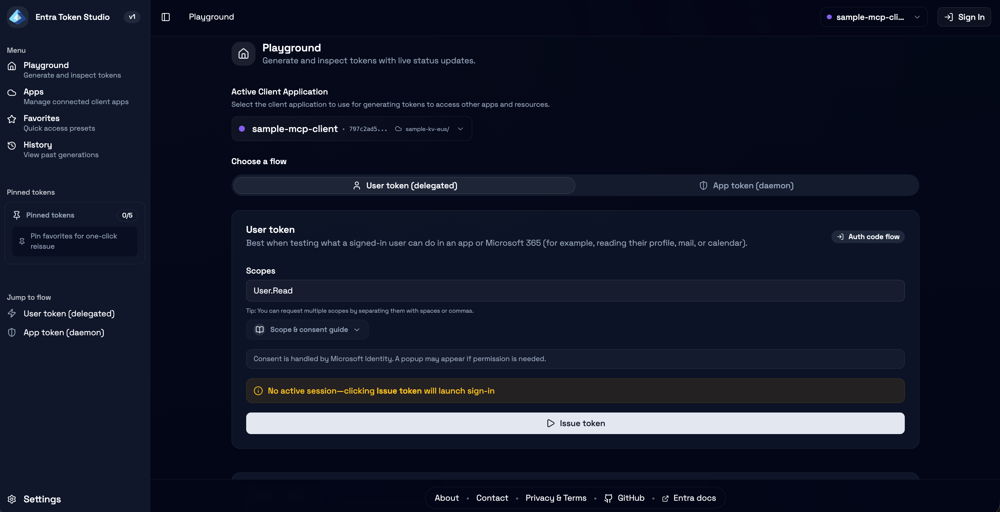

# Entra Token Studio

Read the [blog post](https://raokarthik99.substack.com/p/microsoft-entra-token-studio-a-local) to understand the philosophy and story behind the project.

**A local developer workbench for generating, inspecting, and testing Microsoft Entra access tokens.**

Built with SvelteKit 2, Svelte 5, TypeScript, shadcn components, MSAL, and Azure SDKs.

[](LICENSE)

<div align="center">

**Local-First** · **Open Source** · **Zero Telemetry**

</div>

> 🔒 **Disclaimer:** Entra Token Studio is an independent project and is not affiliated with, endorsed by, or connected to Microsoft Corporation. Use it for local development and education only. Do not paste production tokens into third-party tools, and never deploy this app to a public environment with live credentials.

> ⚠️ **Local-only, developer-supervised use.** This app handles real credentials and live access tokens. Run it on your own machine, keep browser storage under your control, and never deploy it as a shared or multi-user service.




---

## Table of Contents

- [Why This Project Exists](#why-this-project-exists)
- [Features](#features)
- [Prerequisites](#prerequisites)
- [Quickstart](#quickstart)
- [Desktop App (Experimental)](#desktop-app-experimental)
- [How Token Flows Work](#how-token-flows-work)
- [Everyday Use](#everyday-use)
- [Data Boundaries & Security](#data-boundaries--security)
- [Development](#development)
- [Troubleshooting](#troubleshooting)
- [Contributing](#contributing)
- [License](#license)

---

## Why This Project Exists

### The Problem

If you've worked in an enterprise environment with Microsoft Entra ID (formerly Azure AD), you've likely experienced this:

1. **Azure Portal is powerful but overwhelming.** Entra provides enterprise-grade identity management, but the sheer number of features makes day-to-day developer tasks—like testing if "App A can talk to App B"—surprisingly difficult to discover and navigate.

2. **No quick way to generate tokens.** Azure Portal lets you create app registrations and configure credentials (secrets/certificates), but there's no built-in way to quickly issue OAuth tokens for testing. Developers resort to:

   - Writing one-off PowerShell or Python scripts
   - Using curl with manually constructed token requests
   - Copying tokens from browser DevTools
   - Asking colleagues for "that script someone wrote"

3. **Testing identity integration is cumbersome.** After completing onboarding with API B's team, you want to quickly verify that your App A can actually call API B before wiring up the full integration code. But generating that first test token requires navigating OAuth complexity, Entra's specific configuration, and often scattered internal documentation.

4. **Knowledge silos everywhere.** Teams create individual TSGs (Troubleshooting Guides), siloed scripts, and ad-hoc workflows. When production issues occur and you need to validate an API's behavior using your app's identity, developers scramble to find "how do I get a token for this again?"

### The Solution

**Entra Token Studio** bridges the gap between Azure Portal's app configuration and your daily development workflow:

```
┌─────────────────────────┐         ┌─────────────────────────┐
│      Azure Portal       │         │   Entra Token Studio    │
│  (App Registration &    │  ───▶   │  (Day-to-Day Testing &  │
│   Credential Setup)     │         │    Token Generation)    │
└─────────────────────────┘         └─────────────────────────┘
```

**Use Azure Portal** for initial setup: creating app registrations, configuring permissions, setting up certificates and secrets in Key Vault.

**Use Entra Token Studio** for daily work: generating tokens quickly, testing APIs before full integration, debugging authentication issues during live-site incidents, and replacing scattered scripts with a centralized workflow.

### Who This Is For

- **Backend developers** who need app-to-app tokens (client credentials) to test their APIs
- **Frontend developers** who need user tokens (delegated permissions) to test authenticated endpoints
- **Platform engineers** troubleshooting production identity issues
- **Anyone** tired of writing custom scripts just to generate an OAuth token

---

## Features

| Feature                    | Description                                                                                                                        |
| -------------------------- | ---------------------------------------------------------------------------------------------------------------------------------- |
| **Multi-App Workspace**    | Connect multiple app registrations and switch between them seamlessly before generating tokens. Per-app colors, tags, and notes. When you disconnect an app, all linked history, favorites, and pinned tokens are automatically cleaned up. |
| **Multi-User Support**     | Easy sign-in flow for user tokens with identity switching. If you change the connected app, the previous app's user is automatically signed out—tokens always issue in the correct context. |
| **App Tokens**             | Local client credentials flow (web server route or desktop sidecar) using Azure Key Vault secrets/certificates (Key Vault signing for certs) |
| **User Tokens**            | Web: MSAL.js (PKCE) with silent + popup. Desktop: system-browser auth via msal-node + loopback redirect. Includes loading states and cancel flows. |
| **Token Inspection**       | Live expiry badges, floating token dock, full-screen inspector, decoded claims search/filter, and per-claim copy                   |
| **Favorites & History**    | All entries linked to their connected app for clarity. Save configurations with tags/colors/descriptions; pin up to 5 favorites for one-click reissue. Reissue flow automatically uses the correct app. |
| **Smart Suggestions**      | Quick-pick inputs for scopes/resources sourced from favorites, history, and built-in Graph/Azure presets with admin-consent badges |
| **Key Vault Integration**  | Structured error handling with actionable guidance, Azure Portal deep links, credential expiry detection, and severity levels. Automatic credential caching with TTL-based invalidation. |
| **Azure CLI Integration**  | Desktop app lists subscriptions, app registrations, Key Vaults, secrets, and certificates directly via Azure CLI—no manual copying of IDs required. |
| **Auto-Updates**           | Desktop app checks for updates on startup and displays an in-app banner with one-click install. Updates are cryptographically signed. |
| **Responsive Design**      | Fully responsive layout with auto-collapsing sidebar, mobile-friendly tables and toolbars, and proper truncation with tooltips. |
| **Data Portability**       | Export/import all local data (history, favorites, app configs) with security acknowledgments and validation                        |
| **Theme Support**          | Light, dark, and system theme options                                                                                              |

---

## Prerequisites

Before using Entra Token Studio, you need:

### 1. Development Tools

| Tool        | Version | Installation                                                                                                   |
| ----------- | ------- | -------------------------------------------------------------------------------------------------------------- |
| **Node.js** | 20+     | [nodejs.org/en/download](https://nodejs.org/en/download/)                                                      |
| **pnpm**    | Latest  | `npm install -g pnpm` (run this after installing Node.js)                                                      |
| **Rust**    | Latest  | [rust-lang.org/tools/install](https://www.rust-lang.org/tools/install) *(optional — only for desktop app)*    |

> **Why Node.js 20+?** This project uses Vite 7, which requires Node.js 20 or higher. The `.nvmrc` file specifies the required version for easy switching.

> **Why Rust?** The [Tauri desktop app](#desktop-app-experimental) is built with Rust. You only need Rust if you want to develop or build the desktop app from source. For the web version, Node.js and pnpm are sufficient.

> **Managing Node.js versions?** We recommend using a version manager:
> - **macOS/Linux**: [nvm](https://github.com/nvm-sh/nvm) — then run `nvm use` in the project directory
> - **Windows**: [nvm-windows](https://github.com/coreybutler/nvm-windows)

### 2. Azure Identity Access

You need a way to authenticate to Azure for Key Vault access. Choose one:

| Method                      | Best For                  | Setup                                                                                                                                        |
| --------------------------- | ------------------------- | -------------------------------------------------------------------------------------------------------------------------------------------- |
| **Azure CLI**               | Terminal-focused workflow | [Install Azure CLI](https://learn.microsoft.com/en-us/cli/azure/install-azure-cli) → Run `az login`                                          |
| **Managed Identity**        | Azure-hosted environments | Automatically available if running on Azure VMs, App Service, etc.                                                                           |

The studio uses [`DefaultAzureCredential`](https://learn.microsoft.com/en-us/javascript/api/@azure/identity/defaultazurecredential) which automatically discovers your credentials in this order.

### 3. Azure Portal Setup (One-Time)

#### Step A: Create or Configure Your App Registration

1. Go to [Azure Portal](https://portal.azure.com) → **Microsoft Entra ID** → **App registrations**
2. Click **+ New registration** (or select an existing app)
3. Configure the app:

   - **Name**: A descriptive name for your app
   - **Supported account types**: Select based on your needs (usually "Single tenant")
   - **Redirect URIs** (only needed for user tokens):
     - **Web (SPA)**: Add `http://localhost/auth/callback` as a **Single-page application (SPA)** redirect
     - **Desktop (system browser)**: Add `http://localhost` as a **Mobile and desktop applications** redirect

   > **Important:** Using `localhost` without a port allows any localhost port. Add both entries if you plan to use both the web app and the desktop app for user tokens.

   > **Permissions Note:** To add a redirect URI, you must be listed as an **owner** of the app registration, or have an administrative role such as **Global Administrator** or **Cloud App Administrator**. If you cannot modify the app registration, contact your tenant administrator or an existing app owner.

4. Note down:
   - **Application (client) ID** — found on the Overview page
   - **Directory (tenant) ID** — found on the Overview page

📚 [Microsoft Docs: Register an application](https://learn.microsoft.com/en-us/entra/identity-platform/quickstart-register-app)

#### Step B: Set Up Credentials in Azure Key Vault

**Option 1: Using a Client Secret**

1. In your app registration → **Certificates & secrets** → **Client secrets** → **+ New client secret**
2. Copy the secret value (you won't see it again!)
3. Go to your [Key Vault](https://portal.azure.com/#view/HubsExtension/BrowseResource/resourceType/Microsoft.KeyVault%2Fvaults) → **Secrets** → **+ Generate/Import**
4. Name it (e.g., `my-app-secret`) and paste the client secret as the value

**Option 2: Using a Certificate (recommended for production)**

1. In your Key Vault → **Certificates** → **+ Generate/Create**
2. Create a self-signed certificate or import your own
3. In your app registration → **Certificates & secrets** → **Certificates** → **Upload certificate**
4. Upload the public portion of your Key Vault certificate (download as CER from Key Vault)

📚 [Microsoft Docs: Key Vault certificates](https://learn.microsoft.com/en-us/azure/key-vault/certificates/about-certificates)

#### Step C: Grant Key Vault Access

For Entra Token Studio to access your credentials:

1. Go to your Key Vault → **Access control (IAM)** → **+ Add role assignment**
2. Assign one of these roles to your identity (the account you'll use with `az login`):
   - **Key Vault Secrets User** — for client secrets
   - **Key Vault Crypto User** + **Key Vault Certificates User** — for certificates (signing requires crypto access)
   - **Key Vault Administrator** — for both (broader access)

📚 [Microsoft Docs: Assign Key Vault access](https://learn.microsoft.com/en-us/azure/key-vault/general/rbac-guide)

#### Step D: Credential Expiry and Rotation

> ⚠️ **Important:** Both secrets and certificates have expiration dates. You must keep credentials in sync between Key Vault and your app registration.

**For Client Secrets:**
- Secrets created in Entra app registration expire after the period you choose (6 months, 12 months, 24 months, or custom)
- When you rotate a secret, update the value in Key Vault to match the new secret from app registration
- Consider using [Azure Key Vault secret rotation](https://learn.microsoft.com/en-us/azure/key-vault/secrets/tutorial-rotation) for automated rotation

**For Certificates:**
- Certificates have validity periods (typically 1-3 years)
- When you renew/rotate a certificate in Key Vault, upload the new public key (.cer) to your app registration
- Key Vault supports [auto-rotation policies](https://learn.microsoft.com/en-us/azure/key-vault/certificates/overview-renew-certificate) for certificates

**Best Practice:** Set calendar reminders before credential expiry. Expired credentials will cause authentication failures that may be difficult to diagnose.

📚 [Microsoft Docs: Certificate renewal](https://learn.microsoft.com/en-us/azure/key-vault/certificates/overview-renew-certificate)

#### Step E: Configure API Permissions (if needed)

If you're calling specific APIs (like Microsoft Graph):

1. In your app registration → **API permissions** → **+ Add a permission**
2. Select the API and add the required permissions
3. If permissions require admin consent, click **Grant admin consent for [your tenant]**

📚 [Microsoft Docs: Configure permissions](https://learn.microsoft.com/en-us/entra/identity-platform/quickstart-configure-app-access-web-apis)

---

## Quickstart

### Terminal-Focused Workflow

```bash
# 1. Clone and install
git clone https://github.com/raokarthik99/microsoft-entra-token-studio.git
cd microsoft-entra-token-studio
pnpm install

# 2. Sign in to Azure (for Key Vault access)
az login

# 3. Start the dev server
pnpm dev
```

Open [http://localhost:5173](http://localhost:5173) in your browser.

### First Run: Connect Your App

On first visit, you'll be redirected to the **Apps** page with a guided onboarding experience:

1. Click **Connect Your First Client App**
2. Fill in:
   - **Tenant ID** — from your app registration
   - **Client ID** — from your app registration
   - **Key Vault URI** — e.g., `https://your-vault.vault.azure.net`
   - **Credential Name** — the name of your secret or certificate in Key Vault
   - **Credential Type** — Secret or Certificate
3. The app validates Key Vault connectivity before saving
4. You're ready to generate tokens!

---

## Desktop App (Experimental)

Entra Token Studio can also run as a native desktop app using [Tauri](https://tauri.app/). This provides a double-click-to-run experience without needing to start a dev server.

### Prerequisites

- **Rust** — [Install Rust](https://www.rust-lang.org/tools/install)
- **Node.js 20+** — Still required at runtime (the desktop app spawns a Node.js sidecar for Azure SDK operations)

### Running the Desktop App

```bash
# Install dependencies (includes the sidecar package)
pnpm install

# Build the sidecar (required)
pnpm sidecar:build

# Development mode (with hot reload)
pnpm tauri:dev

# Production build
pnpm tauri:build
```

The production build outputs installers to `src-tauri/target/release/bundle/`.

### Why Desktop?

| Benefit | Description |
|---------|-------------|
| **One-click launch** | No terminal commands, no waiting for Vite |
| **Native window** | Proper app icon, taskbar presence, Cmd+Tab friendly |
| **Auto-updates** | Built-in update mechanism (when configured) |
| **Easy sharing** | "Download this .dmg" instead of "clone this repo" |

> **Note:** The desktop app is experimental. The web version (`pnpm dev`) remains the primary distribution method.

### Installation from Releases

You can download pre-built installers from the [GitHub Releases](https://github.com/raokarthik99/microsoft-entra-token-studio/releases) page.

#### ⚠️ macOS Users — "App is Damaged" Error

When you first open the app, macOS will show an error: **"Entra Token Studio is damaged and can't be opened. You should move it to the Trash."**

**This is NOT a bug — the app is not actually damaged.** This happens because:

1. **The app is not signed with an Apple Developer ID certificate** (which requires a $99/year Apple Developer Program membership)
2. **The app is not notarized by Apple**
3. **macOS quarantines all apps downloaded from the internet** and blocks unsigned apps via Gatekeeper

**To fix this:**

1. **Move the app to Applications** (drag from the DMG to Applications folder)
2. **Open Terminal** (Cmd+Space, type "Terminal", press Enter)
3. **Run this command:**
   ```bash
   xattr -cr /Applications/Entra\ Token\ Studio.app
   ```
4. **Open the app again** — it will now launch normally

> 💡 **What does this command do?** The `xattr -cr` command removes the quarantine extended attribute (`com.apple.quarantine`) that macOS adds to downloaded files. This tells Gatekeeper that you trust this app.

> 🔐 **Is this safe?** Yes. You're only removing the quarantine flag for this specific app. The app's code is open source and you can audit it yourself. If you're still concerned, you can [build from source](#running-the-desktop-app) instead.

#### Windows Users — SmartScreen Warning

You may see **"Windows protected your PC"** because the app is not signed with an EV (Extended Validation) code signing certificate, which costs hundreds of dollars per year.

1. Click **More info**
2. Click **Run anyway**

> 💡 Windows SmartScreen is reputation-based. Since this is a new app without widespread usage, it triggers a warning regardless of whether the code is safe.

### Release Process (Maintainers)

#### Creating a Release

To publish a new version of the desktop app:

```bash
# Option A: Create a new release (patch/minor/major)
# Automatically bumps version, syncs files, commits, tags, and pushes.
pnpm release:patch   # or :minor / :major

# Option B: Recreate current tag (re-trigger CI/CD)
# Deletes local/remote tag for current version and recreates it on HEAD.
pnpm release:recreate
```

Alternatively, trigger a release manually from **GitHub Actions → Release → Run workflow**.

#### What the Workflow Does

The [release.yml](.github/workflows/release.yml) workflow:

1. **Creates a draft release** on GitHub
2. **Builds in parallel** for three platforms:
   - **macOS** — Universal binary (Intel + Apple Silicon)
   - **Windows** — x64 installer
   - **Linux** — x64 AppImage and .deb
3. **Signs all artifacts** using your `TAURI_SIGNING_PRIVATE_KEY`
4. **Uploads installers** to the GitHub release:
   - `.dmg` (macOS)
   - `.exe` and `.msi` (Windows)
   - `.AppImage` and `.deb` (Linux)
5. **Generates `latest.json`** for auto-updates
6. **Publishes the release** (removes draft status)

#### Auto-Update Mechanism

When users run the desktop app, it checks for updates on startup:

```
https://github.com/raokarthik99/microsoft-entra-token-studio/releases/latest/download/latest.json
```

If a newer version exists, the app downloads and installs the update automatically. Updates are verified using the public key in [tauri.conf.json](src-tauri/tauri.conf.json).

#### First-Time Setup (One-Time)

1. **Generate a signing keypair:**
   ```bash
   pnpm tauri:signer
   ```
   This creates `~/.tauri/entra-token-studio.key` (private) and `.key.pub` (public).

2. **Add the public key** to `src-tauri/tauri.conf.json`:
   ```bash
   cat ~/.tauri/entra-token-studio.key.pub
   # Copy output to plugins.updater.pubkey
   ```

3. **Add GitHub secrets** (`Settings → Secrets and variables → Actions`):
   | Secret | Value |
   |--------|-------|
   | `TAURI_SIGNING_PRIVATE_KEY` | Contents of `~/.tauri/entra-token-studio.key` |
   | `TAURI_SIGNING_PRIVATE_KEY_PASSWORD` | Password you entered during generation |

4. **Commit the public key:**
   ```bash
   git add src-tauri/tauri.conf.json
   git commit -m "chore: add updater public key"
   git push
   ```

#### Optional: macOS Notarization

Without notarization, macOS users see a Gatekeeper warning. To enable notarization, add these optional secrets:

| Secret | Description |
|--------|-------------|
| `APPLE_CERTIFICATE` | Base64-encoded .p12 certificate |
| `APPLE_CERTIFICATE_PASSWORD` | Certificate password |
| `APPLE_SIGNING_IDENTITY` | e.g., `Developer ID Application: Your Name (TEAMID)` |
| `APPLE_ID` | Your Apple ID email |
| `APPLE_PASSWORD` | App-specific password |
| `APPLE_TEAM_ID` | Your 10-character team ID |

📚 [Tauri macOS code signing guide](https://v2.tauri.app/distribute/sign/macos/)

---

## How Token Flows Work

### App Tokens (Client Credentials)

For server-to-server / app-to-app authentication:

```
┌─────────────────┐      ┌─────────────────────┐      ┌─────────────────┐
│  Entra Studio   │ ───▶ │  Your Key Vault     │ ───▶ │   Entra ID      │
│  (Browser)      │      │  (Secret/Cert)      │      │   (Token)       │
└─────────────────┘      └─────────────────────┘      └─────────────────┘
        │                                                      │
        │◀──────────────────── Access Token ───────────────────│
```

- Client credentials flow using `@azure/msal-node` in a local backend:
  - Web: SvelteKit endpoint `POST /api/token/app`
  - Desktop: Tauri invokes a Node sidecar (JSON-RPC over stdin/stdout)
- Secrets are fetched from Key Vault at runtime; certificates use Key Vault signing (private key never leaves Key Vault)
- Auth method is selected per app config (`secret` or `certificate`) — no local secrets are used for app tokens
- The `/.default` scope is automatically appended to resources

### User Tokens (Delegated Permissions)

For user-context authentication:

```
┌─────────────────┐      ┌─────────────────────┐      ┌─────────────────┐
│  Entra Studio   │ ───▶ │  Entra ID Login     │ ───▶ │   Consent       │
│  (Browser)      │      │  (Popup/Silent)     │      │   (if needed)   │
└─────────────────┘      └─────────────────────┘      └─────────────────┘
        │                                                      │
        │◀──────────────────── Access Token ───────────────────│
```

- Web mode: Authorization Code + PKCE flow using `@azure/msal-browser` (silent first, popup fallback)
- Desktop mode: Authorization Code + PKCE using `@azure/msal-node` in the sidecar (silent first, system browser fallback)
- Tokens are decoded client-side and never logged

---

## Everyday Use

### Generating Tokens

1. **Select your app** from the Playground dropdown (if you have multiple)
2. **Choose token type**:
   - **User Token** — for delegated permissions (on behalf of a user)
   - **App Token** — for client credentials (app-to-app)
3. **Enter resource/scopes**:
   - Use the smart suggestions that surface your favorites, history, and common presets
   - For app tokens: enter the resource URI (e.g., `https://graph.microsoft.com`)
   - For user tokens: enter specific scopes (e.g., `User.Read`, `Mail.Read`)
4. **Issue the token** and see decoded claims instantly

### Staying Organized

- **History** — All token requests are saved with full context and linked to their connected app; use Load to view details or Reissue to regenerate (automatically uses the correct app)
- **Favorites** — Save commonly used configurations with friendly names, tags, and colors—each linked to the app that created it
- **Pinned Favorites** — Pin up to 5 favorites to the navigation for one-click reissue
- **Automatic Cleanup** — When you disconnect an app, all associated history entries, favorites, and pinned tokens are removed to keep your workspace tidy

### Token Inspection

- **Status Badges** — Real-time indicators for valid, expiring, and expired tokens
- **Floating Dock** — Quick access to your active token
- **Full-Screen Inspector** — Deep dive into decoded claims with search and filter (press ESC to close)
- **Per-Claim Copy** — Click any claim to copy its value
- **Important/All Toggle** — Filter claims to show important ones or all

### Data Management

- **Export** — Download all local data (history, favorites, app configs) as JSON with security acknowledgments
- **Import** — Restore data with validation and preview
- **Clear Data** — Selectively clear history, favorites, or all data from Settings

---

## Data Boundaries & Security

| Data Type                   | Storage Location  | Notes                                                         |
| --------------------------- | ----------------- | ------------------------------------------------------------- |
| **Tokens & History**        | Browser IndexedDB | Local only; never leaves your machine                         |
| **Favorites & Preferences** | Browser IndexedDB | Local only                                                    |
| **App Configurations**      | Browser IndexedDB | Stores IDs and metadata only                                  |
| **Credentials**             | Azure Key Vault   | Secrets fetched at runtime; certs use Key Vault signing (private key never leaves) |
| **MSAL Cache (Web)**        | localStorage      | `@azure/msal-browser` cache; cleared on logout                |
| **MSAL Cache (Desktop)**    | On-disk cache     | `@azure/msal-node` cache in the sidecar; encrypted when possible |

**Security principles:**

- Certificate private keys never leave Key Vault — signing happens via `CryptographyClient`
- Secrets and certificates are never written to IndexedDB or exposed to the browser
- No tokens or secrets are intentionally logged
- Export requires explicit security acknowledgments before downloading
- Clear local data on shared machines
- Treat all access tokens as sensitive—avoid pasting them into shared channels

---

## Development

### Commands

| Command            | Description                                                   |
| ------------------ | ------------------------------------------------------------- |
| `pnpm start`       | Build and run the app in production mode                      |
| `pnpm dev`         | Start dev server with HMR (for development)                   |
| `pnpm check`       | Run `svelte-kit sync` + `svelte-check` with strict TypeScript |
| `pnpm check:watch` | Run type checking in watch mode                               |
| `pnpm build`       | Production build to verify SSR stability                      |
| `pnpm preview`     | Serve the built app locally                                   |
| `pnpm tauri:dev`   | Run desktop app in development mode                           |
| `pnpm tauri:build` | Build desktop app installers                                  |
| `pnpm sidecar:build` | Build the desktop sidecar                                   |
| `pnpm sidecar:install` | Install sidecar dependencies (usually covered by `pnpm install`) |

### Project Structure

```
src/
├── routes/
│   ├── +page.svelte              # Playground (main token generation UI)
│   ├── apps/                     # Multi-app onboarding and management
│   ├── auth/callback/            # OAuth redirect handler
│   ├── api/
│   │   ├── token/app/            # App token endpoint
│   │   ├── apps/validate/        # Key Vault validation
│   │   └── health/               # Server health check
│   ├── history/                  # Token history page
│   ├── favorites/                # Favorites management page
│   ├── settings/                 # Preferences and data management
│   ├── about/                    # About page with feature overview
│   ├── contact/                  # Contact information
│   └── legal/                    # Privacy & terms
├── lib/
│   ├── components/               # Shared UI components
│   ├── server/                   # Server-only code (Key Vault, MSAL, certs)
│   ├── services/                 # Client services (auth, persistence)
│   ├── states/                   # Svelte 5 runes-based state management
│   ├── stores/                   # Reactive stores (auth, time)
│   └── data/                     # Scope metadata and presets
└── app.html, app.css             # Global shell and styles

src-tauri/                        # Tauri desktop app (Rust)
├── src/                          # Rust source code
└── tauri.conf.json               # Tauri configuration

sidecar/                          # Node.js sidecar for desktop app
├── src/handlers/                 # Azure SDK operation handlers
└── dist/                         # Compiled JavaScript (gitignored)
```

### Tech Stack

- **Framework:** SvelteKit 2 with Svelte 5 runes
- **UI:** shadcn-svelte components + Tailwind CSS
- **Auth:** `@azure/msal-browser` (web user tokens) + `@azure/msal-node` (app tokens + desktop user tokens)
- **Azure SDK:** `@azure/identity`, `@azure/keyvault-certificates`, `@azure/keyvault-secrets`, `@azure/keyvault-keys`
- **Persistence:** `idb-keyval` for IndexedDB
- **Desktop:** Tauri 2 with Node.js sidecar (experimental)
- **Security:** Certificate private keys never leave Key Vault — signing happens via `CryptographyClient`

---

## Troubleshooting

| Issue                         | Solution                                                                                             |
| ----------------------------- | ---------------------------------------------------------------------------------------------------- |
| **Redirect loop or mismatch** | Ensure `http://localhost/auth/callback` is registered as a SPA redirect (web user tokens). For desktop user tokens, also add `http://localhost` under Mobile/Desktop redirects. |
| **Key Vault access denied**   | Run `az login` and ensure you have `Key Vault Crypto User` (for certs) or `Key Vault Secrets User` (for secrets) |
| **Desktop sidecar fails**     | Run `pnpm sidecar:build` and ensure `node` is available on your PATH                                 |
| **App token fails**           | Verify Tenant ID, Client ID, Key Vault URI, and credential name are correct                          |
| **Scope/resource errors**     | App tokens use resources with `/.default`; user tokens use specific scopes with consent              |
| **Popups blocked (web)**      | Allow popups for `localhost` in your browser settings                                                |
| **Consent errors**            | Check the scopes panel for guidance; you may need admin consent for certain scopes                   |

---

## Contributing

Contributions are welcome! See [AGENTS.md](AGENTS.md) for detailed development guidelines, coding conventions, and testing requirements.

---

## License

MIT. See [LICENSE](LICENSE) for details.

---

<div align="center">

**Built with ❤️ by developers, for developers.**

_Because generating an OAuth token shouldn't require a treasure hunt through documentation._

[Report an Issue](https://github.com/raokarthik99/microsoft-entra-token-studio/issues) · [Request a Feature](https://github.com/raokarthik99/microsoft-entra-token-studio/issues)

</div>
