```mermaid
graph LR
    subgraph "High Friction 🚧"
        Portal[("☁️ Azure Portal<br/>(Configuration)")]
    end

    subgraph "The Gap Entra Token Studio Fills"
        direction TB
        Studio{{"⚡️ Entra Token Studio<br/>(Your Workbench)"}}
    end

    subgraph "Your Daily Work 👨‍💻"
        Code["💻 Your Code<br/>(APIs & Apps)"]
        Debug["🐞 Debugging<br/>(Postman/Curl)"]
    end

    Portal --"1. One-time Setup"--> Studio
    Studio --"2. Instant Tokens"--> Code
    Studio --"3. Inspect Claims"--> Debug

    style Portal fill:#f3e5f5,stroke:#7b1fa2
    style Studio fill:#e3f2fd,stroke:#1565c0,stroke-width:4px
    style Code fill:#e8f5e9,stroke:#388e3c
    style Debug fill:#fff3e0,stroke:#e65100
```

# Microsoft Entra Token Studio: A Local Workbench for OAuth Token Debugging

_Bridging the gap between Azure Portal configuration and the tokens you actually need, without fumbling through dev tools, Postman, or one-off scripts._

[**View on GitHub**](https://github.com/raokarthik99/microsoft-entra-token-studio)


---

## The Problem: Getting Tokens Shouldn't Be This Hard

You've just finished configuring an app registration in Azure Portal. Permissions are granted, certificates uploaded, resources defined. Now you need a token to verify it works.

This is where things go sideways.

You write a quick script using `az account get-access-token`, paste the result into jwt.ms, realize the audience is wrong, fix it, discover the scopes are missing, add them, and by the time you have a valid token—it's expired. The cycle repeats until frustration wins.

**Who is this post for?** Developers and platform engineers working with Microsoft Entra ID who regularly issue tokens for testing, debugging, or integration validation. I'll assume you're familiar with OAuth 2.0 concepts like client credentials, authorization code flow, and the general structure of JWTs.

**What will you learn?** How I designed and built Entra Token Studio—a local-first tool that eliminates the friction between configuring Azure resources and getting tokens into your hands. By the end, you'll understand the security trade-offs, the architecture decisions, and whether this tool fits your workflow.

---

## Why Existing Approaches Fall Short

Most teams I've worked with evolve some combination of these patterns for token issuance:

1. **CLI one-liners** — `az account get-access-token --resource X` works, but breaks the moment you need certificates, custom scopes, or anything beyond the happy path
2. **Throwaway scripts** — Python, PowerShell, or Node scripts that hardcode tenant IDs, fumble with certificate parsing, and rot as OAuth libraries update
3. **Postman collections** — Powerful, but credential management is a nightmare; client secrets end up in shared workspaces or committed to version control
4. **Browser dev tools** — Copy tokens from network tabs, paste into jwt.ms, hope they're still valid when you finish debugging

None of these are _wrong_, but they share a common failure mode: **credentials end up in places they shouldn't**, and **knowledge becomes tribal**. The developer who wrote "the script" leaves, the Postman collection's certificates expire, and the next person starts from scratch.

### The Knowledge Silo Problem

Over time, every team accumulates token-related folklore:

- Half-remembered CLI flags in personal notes
- PowerShell scripts only one person can summon
- Slack threads of base64 blobs and "run this once" instructions
- Internal wikis with TSGs accurate for last quarter's setup

When production breaks at 2 AM and you need to validate whether App A can reach API B, you're searching chat history for incantations instead of solving the problem.

---

## What Entra Token Studio Actually Is

Entra Token Studio is a **local-first developer workbench** for Microsoft Entra tokens. It runs on your machine, speaks native Entra protocols, and makes the token lifecycle predictable: configure once, issue on demand, inspect thoroughly, save what works.


Think of it as a bridge between two phases of identity work:



**On the left**: Azure Portal, where you create app registrations and configure credentials. You do this occasionally.

**On the right**: Your daily work—building APIs, debugging auth failures, validating integrations. You need tokens constantly.

**In the middle**: Entra Token Studio bridges the gap. Wire up your apps once, point to Key Vault credentials, and issue tokens without re-learning OAuth every time.

---

## Security Architecture: Credentials Never Touch the Browser

Before walking through features, I want to address the most important design decision—the one that shaped everything else.

### The Core Principle

> **Long-lived secrets stay server-side. Period.**

The application uses a **Backend-for-Frontend (BFF)** pattern that enforces a clean security boundary:

1. **Browser requests**: "Issue a token for App X targeting resource Y"
2. **Local SvelteKit server**: Fetches the credential from Key Vault using your Azure CLI identity, exchanges it for a token via Entra ID, then immediately discards the credential
3. **What crosses the boundary**: Only the access token—no secrets, certificates, or private keys

For **user tokens** (delegated permissions), the model inverts:

- The browser handles everything via MSAL.js using **Authorization Code + PKCE**
- No client secrets involved—PKCE cryptographically binds the authorization code to your session
- The server doesn't participate at all

This split feels intuitive once you think about it: app tokens require credentials unsuitable for browser exposure, while user tokens are inherently browser-driven and don't require server secrets.

### Trade-offs Worth Acknowledging

This design has constraints:

- **You need Azure CLI or managed identity auth locally**—`az login` is the common path
- **Key Vault is required**—if your credentials live elsewhere, this tool won't help
- **It's local-only by design**—no hosted deployment, no multi-tenancy

These aren't accidental limitations. A hosted token-issuance service would require credential storage and access controls that introduce more problems than they solve. Keeping everything local sidesteps that complexity entirely.

---

## Walkthrough: From App Registration to Working Token

Here's the actual workflow. We'll go from "I just created an app registration" to "I have a token I can debug with."

### Step 1: Connect Your App

The **Apps page** is where you register which app registrations Entra Token Studio should know about and where their credentials live.


For each app, you provide:

- **Tenant ID and Client ID** — standard Entra identifiers
- **Key Vault URI** — the vault holding your certificate or client secret
- **Credential name** — the specific secret or certificate in that vault

Before saving, the app runs a **Key Vault reachability check**. If your RBAC is misconfigured, you find out immediately—not hours later when token issuance silently fails with an unhelpful error.

Common resource presets are available for frequently-used endpoints:

| Resource               | URL                            |
| ---------------------- | ------------------------------ |
| Microsoft Graph        | `https://graph.microsoft.com`  |
| Azure Resource Manager | `https://management.azure.com` |
| Key Vault Data Plane   | `https://vault.azure.net`      |
| Azure SQL              | `https://database.windows.net` |

---

### Step 2: Issue a Token

Head to the **Playground**. Select your app, specify the resource, and click "Issue Token."

The flow is:

1. Request goes to the local server
2. Server pulls the credential from Key Vault (using your Azure identity)
3. Server exchanges the credential for a token with Entra ID
4. Token arrives in your browser, decoded and ready

No more copying base64 from network tabs. No terminal juggling. The token appears, already decoded.

---

### Step 3: Inspect Claims

This is where the tool provides the most value. The **claims inspector** transforms opaque JSON into something navigable:


Key features:

- **Filter by key or value** — quickly locate `roles`, `scp`, `aud`, or custom claims
- **Highlighted important claims** — `aud`, `iss`, `exp`, `roles`, and `scp` are visually distinct
- **Full-screen mode** — useful for tokens with complex permission sets
- **One-click copy** — grab individual claim values for logs, API calls, or documentation

A floating **status dock** tracks token expiry in real time. You'll know at a glance whether that token you copied 45 minutes ago is still valid.

---

### Step 4: User Tokens (Delegated Permissions)

Not every scenario uses app-only tokens. Sometimes you need to test APIs that behave differently based on _who_ is calling—their group memberships, specific permissions, or user principal name.

For delegated access, Entra Token Studio supports **Authorization Code + PKCE**:

1. Click "User Token"
2. Browser initiates a standard Entra login flow
3. PKCE ensures the authorization code can't be intercepted or replayed
4. Token arrives back in the app, decoded and ready


No client secrets required. No server involvement. This is the same public-client OAuth flow that modern SPAs use.

User tokens are treated identically to app tokens in the UI—same claims viewer, same history tracking, same favorites system.

---

### Step 5: History and Favorites

Every token you issue gets logged to **History**:


Each entry captures:

- Timestamp
- App reference
- Flow type (app vs. user)
- Resource and scopes
- The complete decoded token

From history, you can:

- **Load** a previous token to inspect it again
- **Reissue** a fresh token with identical parameters
- **Promote** useful combinations into **Favorites**

Favorites are first-class objects. Name them, add descriptions, assign colors, and **pin** frequently-used ones for instant sidebar access:


The quick-pick input surfaces pinned favorites, recent tokens, and common presets.

The intended workflow becomes a tight loop:

```mermaid
graph TD
    Start((Start)) --> Select["Apps Page<br/>Select/Connect App"]
    Select --> Mode{"Token Mode"}

    Mode --"App Token<br/>(Service)"--> IssueApp["Resource: <br/>graph.microsoft.com"]
    Mode --"User Token<br/>(Delegated)"--> IssueUser["Scopes: <br/>User.Read, Mail.Read"]

    IssueApp --> Token["⚡️ Token Issued"]
    IssueUser --> Token

    Token --> Inspect["🔍 Inspect Claims<br/>(aud, scp, roles)"]
    Inspect --> Action{"Action"}

    Action --"Debug API"--> Copy["📋 Copy Token"]
    Action --"Save Config"--> Favorite["⭐️ Save as Favorite"]
    Action --"Bug Found"--> Reissue["🔄 Reissue"]

    Reissue --> Token
    Favorite --> Start

    style Token fill:#ffe0b2,stroke:#f57c00,stroke-width:2px
    style Favorite fill:#fff9c4,stroke:#fbc02d
    style Start fill:#e3f2fd,stroke:#1565c0
```



Configure once. Issue instantly. Inspect thoroughly. Save what works.

---

## App Tokens vs. User Tokens: When to Use Which

| Aspect                | App Token                            | User Token                                         |
| --------------------- | ------------------------------------ | -------------------------------------------------- |
| **OAuth Grant**       | Client Credentials                   | Authorization Code + PKCE                          |
| **Credential Source** | Azure Key Vault (server-side)        | None (PKCE is cryptographic, not credential-based) |
| **User Interaction**  | None required                        | Browser sign-in required                           |
| **Permissions Type**  | Application permissions              | Delegated permissions                              |
| **Token Contains**    | App identity only                    | User claims (UPN, groups, custom attributes)       |
| **Typical Use Case**  | Daemons, background jobs, automation | APIs that vary behavior per user                   |

Use **app tokens** when you're testing service-to-service calls, background jobs, or anything that runs without a user context.

Use **user tokens** when the API behavior depends on who's calling—role-based access, per-user data, or delegated permission scopes.

---

## Target Audience and Scope

### This tool fits well if you:

- Develop or debug APIs that consume Entra tokens
- Want team-wide consistency instead of tribal knowledge about token issuance
- Prefer a visual claims inspector over squinting at base64 in a terminal
- Value having tokens available without re-learning OAuth incantations each time

### This tool probably isn't for you if you need:

- A hosted, multi-tenant service for token issuance
- Credential storage outside Azure Key Vault
- Production automation or unattended token generation in CI/CD

Entra Token Studio is opinionated about scope: it's a **local developer tool**, not a production service.

---

## Security Model: What the Tool Does and Doesn't Do

### What It Does

- Stores app configs, favorites, and history in **browser IndexedDB** (local, not cloud)
- Fetches credentials from **Key Vault at request time** and immediately discards them
- Uses **PKCE** for user flows (no secrets in the browser)
- Communicates only with Azure resources you configure—no telemetry, tracking, or third-party calls

### What It Explicitly Avoids

- Persisting Key Vault credentials locally
- Logging tokens or secrets server-side
- Analytics or phone-home behavior
- Storing any data outside your browser and Azure

### Best Practices Still Apply

Tokens are sensitive. Even with solid tooling:

1. **Treat tokens as credentials.** They represent access, not just debug artifacts.
2. **Use short-lived tokens** where possible. The default 1-hour lifetime is reasonable for development.
3. **Clear local data** on shared machines (history, favorites, app configs are in IndexedDB).
4. **Audit Key Vault access logs** if using this with production vaults.

---

## Getting Started

### Prerequisites

| Requirement                                  | Purpose                                     |
| -------------------------------------------- | ------------------------------------------- |
| **Node.js 18+**                              | Runtime (LTS recommended)                   |
| **pnpm**                                     | Package manager                             |
| **OpenSSL**                                  | For PKCS#12/PFX certificate parsing         |
| **Azure CLI** or **VS Code Azure extension** | For `DefaultAzureCredential` authentication |

### Installation

```bash
# Clone the repository
git clone https://github.com/raokarthik99/microsoft-entra-token-studio.git
cd microsoft-entra-token-studio

# Install dependencies
pnpm install

# Set up environment
cp .env.example .env

# Log in to Azure (for Key Vault access)
az login

# Start the dev server
pnpm dev
```

Open `http://localhost:5173` and you're running.

### Authenticating to Azure

The server uses `DefaultAzureCredential`, which attempts multiple authentication methods in order:

1. Environment variables (`AZURE_CLIENT_ID`, `AZURE_TENANT_ID`, etc.)
2. Managed Identity (if running in Azure)
3. VS Code Azure Account extension
4. Azure CLI (`az login`) — most common for local development
5. Azure PowerShell

For local development, `az login` is typically all you need.

### Key Vault Permissions

Your identity needs read access to secrets and/or certificates in your Key Vault.

**For secrets:**

```bash
az role assignment create \
  --role "Key Vault Secrets User" \
  --assignee <your-object-id> \
  --scope /subscriptions/<sub>/resourceGroups/<rg>/providers/Microsoft.KeyVault/vaults/<vault>
```

**For certificates:**

```bash
az role assignment create \
  --role "Key Vault Certificates User" \
  --assignee <your-object-id> \
  --scope /subscriptions/<sub>/resourceGroups/<rg>/providers/Microsoft.KeyVault/vaults/<vault>
```

---

## Configuring Entra for User Tokens

If you want to use the **user token** flow (Authorization Code + PKCE), your Entra app registration needs specific configuration.

### Add a Redirect URI

Add the following as a **Single-page application (SPA)** redirect URI:

```text
http://localhost:5173/auth/callback
```

Use the **SPA** platform type, not "Web". The Web platform has different CORS and implicit grant expectations that break MSAL.js browser flows.

### Add API Permissions

Add delegated scopes for what you want to test:

| Scope             | Purpose             |
| ----------------- | ------------------- |
| `User.Read`       | Sign-in and profile |
| `Mail.Read`       | Read user's mail    |
| `Files.ReadWrite` | OneDrive access     |

For **app-only** tokens, configure **application permissions** and grant admin consent.

### Certificate Setup (for App Tokens)

If using certificate-based authentication:

1. Create or upload a certificate in **Key Vault** (self-signed works for development)
2. Download the **public** portion (`.cer`)
3. Upload to your app registration's **Certificates & secrets** blade
4. Reference the **Key Vault certificate name** in Entra Token Studio

The server handles both **PEM** and **PKCS#12/PFX** formats, with fallback to local OpenSSL for modern PFX encryption that pure JavaScript can't parse.

---

## Architecture Notes

For those interested in extending the tool or understanding the implementation:

```text
src/
├── lib/
│   ├── components/       # Svelte components (forms, claims viewer, favorites, history)
│   ├── services/         # Azure SDK wrappers (auth, key vault, data export)
│   ├── states/           # Svelte 5 runes-based state (apps, history, favorites)
│   ├── stores/           # Misc stores (time, auth state)
│   └── shadcn/           # UI component library primitives
├── routes/
│   ├── +page.svelte      # Playground dashboard
│   ├── apps/             # App management & onboarding
│   ├── history/          # Token history
│   ├── favorites/        # Saved configurations
│   ├── settings/         # Theme, data, import/export
│   └── auth/             # Auth callback handler
└── lib/server/           # Key Vault, cert parsing, MSAL confidential client
```

### Technology Choices

| Layer              | Choice                                 | Rationale                                            |
| ------------------ | -------------------------------------- | ---------------------------------------------------- |
| **Framework**      | SvelteKit 2 + Svelte 5                 | Server actions, clean routing, minimal client bundle |
| **UI**             | shadcn-svelte                          | Accessible, composable, styling flexibility          |
| **Entra (server)** | `@azure/msal-node`                     | Robust confidential client support                   |
| **Key Vault**      | `@azure/identity`, `@azure/keyvault-*` | Full secret/cert access via DefaultAzureCredential   |
| **Client storage** | `idb-keyval` (IndexedDB)               | More capacity than localStorage, structured data     |

SvelteKit's separation of server routes and client components keeps the security model honest: anything touching credentials lives server-side. The browser is a thin, reactive shell for input, display, and local persistence.

---

## Summary and Next Steps

Entra Token Studio addresses a specific gap: the friction between configuring identity in Azure Portal and having tokens available for development work.

**Key ideas:**

- **Local-first design** — runs on your machine, stores data in your browser, communicates only with Azure resources you configure
- **Credentials stay server-side** — the BFF pattern ensures secrets and certificates never reach the browser
- **Two token flows** — app tokens (client credentials via Key Vault) and user tokens (PKCE via browser)
- **Workflow optimized** — history, favorites, and pinned shortcuts reduce repetitive configuration

**To try it:**

1. Clone the [repository](https://github.com/raokarthik99/microsoft-entra-token-studio)
2. Run `pnpm install && pnpm dev`
3. Log in with `az login` and connect your first app

**To extend it:**

- The codebase is straightforward SvelteKit—server routes for credential handling, client components for UI
- PRs welcome for custom resource presets, additional claim highlighting, or workflow improvements

---

**Links**

[View on GitHub](https://github.com/raokarthik99/microsoft-entra-token-studio) · [MIT License](https://github.com/raokarthik99/microsoft-entra-token-studio/blob/main/LICENSE)

---

_Built with SvelteKit, shadcn-svelte, and enough late-night debugging sessions to motivate building something better._
