# Entra Token Studio: A Local Developer Workbench for Microsoft Entra ID

_Or: stop copy‑pasting access tokens from dev tools._

**TL;DR:** Entra Token Studio is a **local‑first workbench** for generating and inspecting Microsoft Entra (Azure AD) access tokens. It keeps credentials in **Azure Key Vault**, stores history in **IndexedDB**, and supports both **client credentials** and **authorization code + PKCE** flows with strict security boundaries.

[GitHub](https://github.com/raokarthik99/microsoft-entra-token-studio) · [MIT License](https://github.com/raokarthik99/microsoft-entra-token-studio/blob/main/LICENSE)

---

## Why This Exists

If you work with Microsoft Entra ID long enough, you start to build a personal museum of hacks:

- Half‑remembered `az account get-access-token` commands  
- PowerShell scripts that only one person on the team knows how to fix  
- Postman collections with expired certificates and mystery client IDs  
- Slack messages full of base64 blobs and “just run this once” instructions  

The gap between:

- “I configured an app registration in Azure Portal” 
and  
- “I have a token I trust to debug this API” 

is still surprisingly wide.

Entra Token Studio is my attempt to close that gap with something I actually enjoy using: a **browser UI that runs locally**, speaks fluent Entra, respects security boundaries, and makes tokens feel _boring_ again (in a good way).

---

## What Entra Token Studio Is (In One Picture)

At a high level, the app is a **secure local bridge** between:

- Your **Entra app registrations + Key Vault credentials**, and  
- Your **day‑to‑day development work** (APIs, CLIs, Postman, etc.)

```mermaid
graph LR
    subgraph "High Friction 🚧"
        Portal[("☁️ Azure Portal<br/>(Configuration)")]
    end

    subgraph "The Gap Entra Token Studio Fills"
        direction TB
        Studio{{"⚡️ Entra Token Studio<br/>(Your Workbench)"}}
    end

    subgraph "Your Daily Work 👨‍💻"
        Code["💻 Your Code<br/>(APIs & Apps)"]
        Debug["🐞 Debugging<br/>(Postman/Curl)"]
    end

    Portal --"1. One-time Setup"--> Studio
    Studio --"2. Instant Tokens"--> Code
    Studio --"3. Inspect Claims"--> Debug
    
    style Portal fill:#f3e5f5,stroke:#7b1fa2
    style Studio fill:#e3f2fd,stroke:#1565c0,stroke-width:4px
    style Code fill:#e8f5e9,stroke:#388e3c
    style Debug fill:#fff3e0,stroke:#e65100
```



You configure apps once, wire them up to Key Vault, and then issue tokens on demand—without re‑teaching yourself all the OAuth incantations every time.

---

## How It Works (Without Hand‑Waving)

### A “No‑Touch” Security Model

The most important design decision was simple:

> **Long‑lived credentials never live in the browser.**

Instead, the app uses a local‑only **Backend‑for‑Frontend (BFF)** pattern:

1. **Browser**: “I need a token for App X with resource Y.” 
2. **SvelteKit server**: “I know App X uses Key Vault entry Z. I’ll fetch that cert/secret, exchange it for a token, and then drop the credential.” 
3. **Azure AD**: Issues the token.  
4. **Server → Browser**: Only the **access token** crosses the boundary—no secrets, no certificates.

For app tokens (client credentials flow), the server:

1. Receives a request with tenant ID, client ID, resource, and a **credential reference** (not the secret itself).  
2. Uses `DefaultAzureCredential` to access Key Vault and fetch either:
   - A client secret, or  
   - A certificate (PEM or PKCS#12/PFX).  
3. Exchanges it for an access token against Microsoft Entra ID.  
4. Returns **only the access token** to the browser.

For user tokens (authorization code + PKCE), the flow is the opposite:

- The **browser handles everything** via MSAL.js.  
- There are **no client secrets** involved—PKCE (RFC 7636) binds the authorization code to the original request using a code verifier/challenge.  
- The SvelteKit server sits this one out entirely.

### Under the Hood: Technology Choices

| Layer | Choice | Rationale |
|-------|--------|-----------|
| **Framework** | SvelteKit 2 + Svelte 5 | Server actions, flexible routing, minimal client bundle |
| **UI** | shadcn-svelte | Accessible, composable, unopinionated styling |
| **Entra (server)** | `@azure/msal-node` | Robust confidential client support and token handling |
| **Key Vault access** | `@azure/identity`, `@azure/keyvault-secrets`, `@azure/keyvault-certificates` | Uses `DefaultAzureCredential`, supports secrets and certs |
| **Client storage** | `idb-keyval` (IndexedDB) | Structured local data with more room than `localStorage` |

SvelteKit’s split between **server routes** and **client components** keeps the boundaries honest: anything that touches credentials lives server‑side; the browser is a thin, reactive shell for input, display, and local history.

---

## A Guided Tour of the Workbench

Let’s walk through a typical session: connect an app, issue tokens, debug, and save your favorite setups.

### 1. Connect an Entra App Registration

The first stop is the **Apps** page: this is where you tell Entra Token Studio _which_ app registrations you want to work with and _where_ their credentials live in Key Vault.


Each app configuration includes:

- **Tenant ID & Client ID** – the usual Entra identifiers  
- **Key Vault URI** – the vault that holds your cert or client secret  
- **Credential name** – the secret or certificate name inside that vault  

Before saving, the app performs a **Key Vault reachability/permissions check** so you find out immediately if RBAC is misconfigured.

Apps are persisted in **IndexedDB** and can be color‑coded to visually distinguish environments (dev/staging/prod) when switching between them.

The resource input supports commonly used endpoints out of the box:

- `https://graph.microsoft.com` – Microsoft Graph  
- `https://management.azure.com` – Azure Resource Manager  
- `https://vault.azure.net` – Key Vault data plane  
- `https://database.windows.net` – Azure SQL  

---

### 2. Issue a Token and Inspect Its Claims

Once an app is connected, you head to the **Playground** to actually issue tokens.

Tokens are decoded client‑side (JWTs are just base64) and rendered in a **searchable, filterable, full‑screenable** view:


The claims inspector:

- Filters by key or value so you can quickly find a specific claim.  
- Highlights important claims like `aud`, `iss`, `exp`, `roles`, and `scp`.  
- Supports a **full‑screen mode** for complex tokens.  
- Offers one‑click copy for individual claim values when you need to paste them into logs, tests, or docs.

A floating **status dock** tracks token expiry in real time so you can see at a glance whether the token you’re using in Postman is still valid or just barely hanging on.

---

### 3. User Tokens via Authorization Code + PKCE

Not everything is app‑only—sometimes you need to debug an API that behaves differently based on user identity.

For that, Entra Token Studio supports delegated access using **Authorization Code + PKCE** via MSAL.js:

- The browser initiates the login and consent flow.  
- A code challenge/verifier pair ensures the authorization code can’t be replayed elsewhere.  
- No client secret is required because this is a **public client** scenario.  

Once MSAL completes the flow, the resulting access token is treated like any other in the UI: it shows up in the claims viewer, history, and favorites.

---

### 4. History, Favorites, and a Repeatable Dev Loop

Every time you issue a token, the app logs a history entry in IndexedDB with:

- Timestamp  
- App reference  
- Flow type (app vs. user)  
- Resource and scopes  
- A token hash (for deduping), plus the full token payload  

The intended workflow looks something like this:

```mermaid
graph TD
    Start((Start)) --> Select["Apps Page<br/>Select/Connect App"]
    Select --> Mode{"Token Mode"}
    
    Mode --"App Token<br/>(Service)"--> IssueApp["Resource: <br/>graph.microsoft.com"]
    Mode --"User Token<br/>(Delegated)"--> IssueUser["Scopes: <br/>User.Read, Mail.Read"]
    
    IssueApp --> Token["⚡️ Token Issued"]
    IssueUser --> Token
    
    Token --> Inspect["🔍 Inspect Claims<br/>(aud, scp, roles)"]
    Inspect --> Action{"Action"}
    
    Action --"Debug API"--> Copy["📋 Copy Token"]
    Action --"Save Config"--> Favorite["⭐️ Save as Favorite"]
    Action --"Bug Found"--> Reissue["🔄 Reissue"]
    
    Reissue --> Token
    Favorite --> Start
    
    style Token fill:#ffe0b2,stroke:#f57c00,stroke-width:2px
    style Favorite fill:#fff9c4,stroke:#fbc02d
    style Start fill:#e3f2fd,stroke:#1565c0
```



From the **History** view:


You can:

- **Load** a previous token to inspect it again.  
- **Reissue** a fresh token with the same parameters.  
- **Promote** a useful combo into a **Favorite** with a name, description, color, and tags.

Favorites are first‑class citizens:


- They show up in a dedicated **Favorites** page.  
- You can pin your top entries for one‑click access.  
- Quick‑pick inputs surface pinned favorites, recents, and Graph/Azure presets—with admin‑consent badges for sensitive scopes.

---

## App vs. User Tokens at a Glance

| Aspect | App Token | User Token |
|--------|-----------|------------|
| **OAuth grant** | Client Credentials | Authorization Code + PKCE |
| **Credential location** | Azure Key Vault (server‑side) | None (PKCE, public client) |
| **User interaction** | None | Browser sign‑in required |
| **Permissions** | Application permissions | Delegated permissions |
| **Token contains** | App identity only | User claims (UPN, groups, etc.) |
| **Typical use** | Daemons, background services, automation | APIs that behave differently per user |

---

## When to Reach for This Tool

Entra Token Studio is built for:

- **Local development and debugging** of APIs that use Entra tokens.  
- Teams that want a **repeatable, documented way** to get tokens without tribal knowledge.  
- Developers who prefer a **visual claims inspector** over staring at base64‑encoded blobs.  

It is _not_ designed for:

- Hosting as a shared, multi‑tenant internal service.  
- Persisting long‑lived credentials outside Azure Key Vault.  
- Production traffic or unattended automation jobs.

### What It Does

- Stores app configurations, favorites, and token history in **browser IndexedDB**.  
- Fetches credentials from **Key Vault at request time** and discards them after use.  
- Implements **PKCE** for user flows (no secrets in the browser).  
- Talks only to Azure resources you configure—no telemetry, tracking, or third‑party APIs.

### What It Explicitly Avoids

- Persisting Key Vault credentials locally.  
- Logging tokens or secrets on the server.  
- Shipping analytics libraries or phone‑home behavior.  

Security‑wise, the best practices still apply:

1. **Treat tokens as credentials.** They represent access, not just “debug artifacts.” 
2. **Use short‑lived tokens** where possible (1‑hour default is usually fine for local dev).  
3. **Clear local data** (history, favorites, apps) on shared machines.  
4. **Audit Key Vault access logs** for production scenarios.

---

## Getting It Running Locally (How)

### Prerequisites

You’ll need:

| Requirement | Purpose |
|-------------|---------|
| **Node.js 18+** | Runtime (LTS recommended) |
| **pnpm** | Package manager |
| **OpenSSL** | PKCS#12/PFX certificate parsing |
| **Azure CLI** or **VS Code Azure extension** | For `DefaultAzureCredential` (dev) |

### Installation

```bash
git clone https://github.com/raokarthik99/microsoft-entra-token-studio.git
cd microsoft-entra-token-studio
pnpm install
cp .env.example .env
```

### Authenticating to Azure

The server uses `DefaultAzureCredential`, which tries (in order):

1. Environment variables (`AZURE_CLIENT_ID`, `AZURE_TENANT_ID`, `AZURE_CLIENT_SECRET`, etc.)  
2. Managed Identity (if you ever host this in Azure).  
3. Visual Studio Code Azure Account extension.  
4. Azure CLI (`az login`).  
5. Azure PowerShell.

For local development, `az login` is enough:

```bash
az login
pnpm dev
```

### Key Vault RBAC

Your identity must be able to read secrets and/or certificates from the Key Vault that holds your app’s credentials.

For secrets:

```bash
az role assignment create \
  --role "Key Vault Secrets User" \
  --assignee <your-object-id> \
  --scope /subscriptions/<sub>/resourceGroups/<rg>/providers/Microsoft.KeyVault/vaults/<vault>
```

For certificates:

```bash
az role assignment create \
  --role "Key Vault Certificates User" \
  --assignee <your-object-id> \
  --scope /subscriptions/<sub>/resourceGroups/<rg>/providers/Microsoft.KeyVault/vaults/<vault>
```

---

## Wiring Up Entra App Registrations (When)

To use the **user token** flow (Authorization Code + PKCE), your Entra app registration needs a few specific settings.

### Redirect URI

Add the following as a **Single‑page application (SPA)** redirect URI:

```text
http://localhost:5173/auth/callback
```

> **Important:** Use the **SPA** app type, not “Web”. Web app redirect URIs come with different expectations around CORS and authentication flows; using SPA ensures MSAL.js behaves correctly in the browser.

### API Permissions

Add delegated scopes based on what you plan to test. Common examples:

- `User.Read` – sign‑in and profile  
- `Mail.Read` – read mail  
- `Files.ReadWrite` – OneDrive access  

For **app‑only** tokens, configure **application permissions** instead and grant admin consent.

### Certificates

For certificate‑based app authentication:

1. Create or upload a certificate in **Key Vault** (self‑signed is fine for dev).  
2. Download the **public** portion (`.cer`).  
3. Upload that to your app registration’s **Certificates & secrets** blade.  
4. In Entra Token Studio, reference the **Key Vault certificate name** in the app configuration.

The server supports both **PEM** and **PKCS#12/PFX** formats, and falls back to the local **OpenSSL** CLI for modern PFX encryption that pure JS libraries can’t parse.

---

## Under the Hood: Project Layout

If you’d like to poke around or extend the app, here’s the high‑level structure:

```text
src/
├── lib/
│   ├── components/       # Svelte components (forms, modals, claims viewer, favorites, history)
│   ├── services/         # Azure SDK wrappers (auth, key vault, data export)
│   ├── states/           # Svelte 5 runes-based state (apps, history, favorites, suggestions)
│   ├── stores/           # Misc stores (e.g., time, auth)
│   └── shadcn/           # UI component library primitives
├── routes/
│   ├── +page.svelte      # Playground dashboard (flows, decoded output, history preview)
│   ├── apps/             # App management & onboarding
│   ├── history/          # Token history
│   ├── favorites/        # Saved configurations
│   ├── settings/         # Theme, data clearing, import/export
│   └── auth/             # Auth callback handler
└── lib/server/           # Key Vault, certificate parsing, MSAL confidential client
```

State is managed with **Svelte 5 runes**, IndexedDB via `idb-keyval`, and a handful of focused services for history, favorites, and quick‑pick suggestions.

---

## Conclusion

Entra Token Studio is meant to be the tool you reach for when you’re in the middle of debugging an Entra‑protected API and just want a clean, trustworthy way to get tokens, inspect them, and iterate quickly—without reinventing all the OAuth and Key Vault plumbing each time. If that sounds like the kind of friction you’ve run into before, clone the repo, point it at your Key Vault, and let it handle the hard parts while you focus on your application code.
