```mermaid
graph LR
    subgraph "High Friction 🚧"
        Portal[("☁️ Azure Portal<br/>(Configuration)")]
    end

    subgraph "The Gap Entra Token Studio Fills"
        direction TB
        Studio{{"⚡️ Entra Token Studio<br/>(Your Workbench)"}}
    end

    subgraph "Your Daily Work 👨‍💻"
        Code["💻 Your Code<br/>(APIs & Apps)"]
        Debug["🐞 Debugging<br/>(Postman/Curl)"]
    end

    Portal --"1. One-time Setup"--> Studio
    Studio --"2. Instant Tokens"--> Code
    Studio --"3. Inspect Claims"--> Debug

    style Portal fill:#f3e5f5,stroke:#7b1fa2
    style Studio fill:#e3f2fd,stroke:#1565c0,stroke-width:4px
    style Code fill:#e8f5e9,stroke:#388e3c
    style Debug fill:#fff3e0,stroke:#e65100
```

```mermaid
graph TD
    Start((Start)) --> Select["Apps Page<br/>Select/Connect App"]
    Select --> Mode{"Token Mode"}

    Mode --"App Token<br/>(Service)"--> IssueApp["Resource: <br/>graph.microsoft.com"]
    Mode --"User Token<br/>(Delegated)"--> IssueUser["Scopes: <br/>User.Read, Mail.Read"]

    IssueApp --> Token["⚡️ Token Issued"]
    IssueUser --> Token

    Token --> Inspect["🔍 Inspect Claims<br/>(aud, scp, roles)"]
    Inspect --> Action{"Action"}

    Action --"Debug API"--> Copy["📋 Copy Token"]
    Action --"Save Config"--> Favorite["⭐️ Save as Favorite"]
    Action --"Bug Found"--> Reissue["🔄 Reissue"]

    Reissue --> Token
    Favorite --> Start

    style Token fill:#ffe0b2,stroke:#f57c00,stroke-width:2px
    style Favorite fill:#fff9c4,stroke:#fbc02d
    style Start fill:#e3f2fd,stroke:#1565c0
```

# Entra Token Studio: A Local Developer Workbench for Microsoft Entra ID

**TL;DR:** A local-first tool for generating and inspecting Microsoft Entra (Azure AD) access tokens. Keeps credentials in Key Vault, stores history in IndexedDB, and implements both client credentials and authorization code flows with proper security boundaries.

[GitHub](https://github.com/raokarthik99/microsoft-entra-token-studio) · [MIT License](https://github.com/raokarthik99/microsoft-entra-token-studio/blob/main/LICENSE)

---

## Background

Working with Microsoft Entra ID in enterprise environments means dealing with OAuth 2.0 flows, app registrations, and access tokens constantly. Yet the tooling gap between "I configured an app in Azure Portal" and "I need a token to test this API endpoint" remains surprisingly wide.

The typical workflow involves scattered PowerShell scripts, curl commands with certificate parameters, or digging through browser DevTools to extract tokens from authenticated sessions. Each developer maintains their own collection of helpers, and knowledge transfer usually happens via Slack messages containing base64-encoded certificates.

This tool addresses that gap directly: a browser-based workbench that handles credential management through Key Vault, implements OAuth flows correctly, and provides visibility into token contents—all running locally with no external dependencies beyond Azure.

---

## The Architecture: A "Local-First" Bridge

The core architectural idea is simple: valid OAuth tokens are difficult to craft manually but easy to request if you have the right plumbing.

Entra Token Studio acts as a secure **local bridge** between your configuration (in Azure) and your daily development work (in your IDE/Terminal).



### Security First: The "No-Touch" Model

The most critical architectural decision was the security boundary. To be safe for daily use, we needed a guarantee: **Long-lived credentials never touch the browser storage.**

The app implements a "stateless server" pattern for credentials:
1.  **Browser**: "I need a token for App X." (No secrets sent)
2.  **Local Server**: "I know App X uses Key Vault. I'll fetch the cert, exchange it for a token, and drop the cert immediately."
3.  **Azure**: "Here is the token."
4.  **Local Server**: "Here is the token, Browser." (No secrets returned)

This is effectively a **local-only Backend-for-Frontend (BFF)** that handles the dangerous cryptography so your browser doesn't have to. 

For app tokens (client credentials flow), the SvelteKit server-side action:
1. Receives a request specifying tenant, client ID, resource, and credential reference
2. Fetches the certificate or secret from Key Vault using `DefaultAzureCredential`
3. Performs the OAuth token request against Entra ID
4. Returns only the issued access token to the browser

For user tokens (authorization code + PKCE), MSAL.js handles the flow entirely client-side—no secrets involved, as PKCE eliminates the need for a client secret.

### Technology Choices

| Layer | Choice | Rationale |
|-------|--------|-----------|
| **Framework** | SvelteKit 2, Svelte 5 | Server actions, form handling, minimal client bundle |
| **Components** | shadcn-svelte | Accessible, composable, no vendor lock-in |
| **Azure SDK** | `@azure/msal-node`, `@azure/identity` | Official SDKs, handles token caching and refresh |
| **Key Vault** | `@azure/keyvault-certificates`, `@azure/keyvault-secrets` | Direct API, supports both cert types |
| **Client Storage** | `idb-keyval` (IndexedDB) | Structured persistence, larger quota than localStorage |

The choice of SvelteKit specifically enables clean separation: form actions run server-side with full Node.js capability (OpenSSL bindings for PFX parsing, filesystem access), while the client remains a thin presentation layer.

---

## Features in Detail

### Connecting App Registrations

Each connected app represents an Entra app registration with associated Key Vault credentials. The connection form validates Key Vault reachability before persisting.


Configuration includes:
- **Tenant ID / Client ID**: Standard Entra identifiers
- **Key Vault URI**: Points to the vault containing credentials
- **Credential Type**: Certificate (PFX) or client secret
- **Credential Name**: The certificate or secret name in Key Vault

Apps are stored in IndexedDB with optional color coding for visual differentiation when switching between environments (dev/staging/prod).


The resource input supports common Azure endpoints:
- `https://graph.microsoft.com` – Microsoft Graph
- `https://management.azure.com` – Azure Resource Manager
- `https://vault.azure.net` – Key Vault data plane
- `https://database.windows.net` – Azure SQL

---

### Token Inspection

Once issued, tokens are decoded client-side (JWTs are base64, no secrets involved) and displayed in a searchable, filterable view.


The claims viewer:
- Filters claims by key or value
- Highlights important claims (`aud`, `iss`, `exp`, `roles`, `scp`)
- Supports full-screen expansion for complex tokens
- Provides one-click copy for individual claim values


The floating status dock shows token expiration countdown, which is useful when testing APIs that validate `exp` claims strictly.

---

### User Token Issuance (Authorization Code + PKCE)

For delegated permission scenarios, the tool implements Authorization Code flow with PKCE using MSAL.js.

**Why PKCE matters:** Public clients (browser apps, native apps) cannot securely store client secrets. PKCE (RFC 7636) mitigates authorization code interception attacks by binding the token request to the original authorization request through a cryptographic code verifier.


This runs entirely client-side. The SvelteKit server is not involved.

---

### History and Favorites

Every token issuance logs to IndexedDB with:
- Timestamp
- App reference
- Flow type (app/user)
- Resource/scopes
- Token hash (for deduplication, not the actual token)
- Full token (encrypted at rest)

### The Developer Workflow

The tool is designed around a repeatable "configure → issue → debug" cycle:




From history, you can:
- **Load**: View token details without re-issuing
- **Reissue**: Generate a fresh token with same parameters
- **Favorite**: Save for quick access with custom labels

Favorites support tags and can be pinned to the navigation bar (up to 5) for one-click access to frequently-used configurations.


---

## Authentication Flow Comparison

| Aspect | App Token | User Token |
|--------|-----------|------------|
| **OAuth Grant** | Client Credentials | Authorization Code + PKCE |
| **Credential Location** | Key Vault (server-side) | None (PKCE eliminates secrets) |
| **User Interaction** | None | Browser sign-in |
| **Permissions** | Application permissions | Delegated permissions |
| **Token Contains** | App identity only | User claims (UPN, groups, etc.) |
| **Use Case** | Backend services, daemons | APIs with user context |


---

## Setup

### Prerequisites

| Requirement | Purpose |
|-------------|---------|
| **Node.js 18+** | Runtime (LTS recommended) |
| **pnpm** | Package manager |
| **OpenSSL** | PFX certificate parsing |
| **Azure CLI** or **VS Code Azure ext** | `DefaultAzureCredential` chain |

### Installation

```bash
git clone https://github.com/raokarthik99/microsoft-entra-token-studio.git
cd microsoft-entra-token-studio
pnpm install
cp .env.example .env
```

### Azure Authentication

The server uses `DefaultAzureCredential`, which tries (in order):
1. Environment variables (`AZURE_CLIENT_ID`, etc.)
2. Managed Identity (if running in Azure)
3. Visual Studio Code credential (Azure extension)
4. Azure CLI credential (`az login`)
5. Azure PowerShell credential


For local development, `az login` is sufficient:

```bash
az login
pnpm dev
```

### Required RBAC

Your identity needs access to Key Vault secrets/certificates:

```bash
# For secrets
az role assignment create \
  --role "Key Vault Secrets User" \
  --assignee <your-object-id> \
  --scope /subscriptions/<sub>/resourceGroups/<rg>/providers/Microsoft.KeyVault/vaults/<vault>

# For certificates
az role assignment create \
  --role "Key Vault Certificates User" \
  --assignee <your-object-id> \
  --scope /subscriptions/<sub>/resourceGroups/<rg>/providers/Microsoft.KeyVault/vaults/<vault>
```

---

## Entra App Registration Configuration

For user token flows (PKCE), the app registration requires:

### Redirect URI

Add `http://localhost:5173/auth/callback` as a **Single-page application (SPA)** redirect URI.

> **Critical:** Must be SPA type, not Web. Web redirect URIs expect CORS headers that localhost won't provide correctly, and more importantly, the authorization endpoint behavior differs for SPA vs. Web apps.

### API Permissions

Add delegated scopes as needed. Common examples:
- `User.Read` (sign-in and profile)
- `Mail.Read` (read email)
- `Files.ReadWrite` (OneDrive access)

For app-only tokens, add application permissions instead and grant admin consent.

### Certificates

For certificate-based auth:
1. Generate or upload a certificate in Key Vault (self-signed works for dev)
2. Download the public portion (.cer)
3. Upload to the app registration's **Certificates & secrets** blade
4. Reference the certificate name in the tool's app configuration

---

## Security Considerations

### What This Tool Does

- Stores app configurations and tokens in browser IndexedDB
- Fetches credentials from Key Vault at runtime only
- Implements PKCE for user flows (no client secrets in browser)
- Runs entirely locally—no external API calls except to Azure

### What This Tool Does Not Do

- Persist credentials locally (Key Vault is the source of truth)
- Log tokens server-side
- Include telemetry, analytics, or error reporting
- Support multi-user or shared hosting

### Recommendations

1. **Clear local data** when done, especially on shared machines
2. **Treat access tokens as credentials**—they grant access to resources
3. **Use short-lived tokens** when possible (default is 1 hour)
4. **Audit Key Vault access logs** in production scenarios

---

### Project Structure

```
src/
├── lib/
│   ├── components/       # Svelte components (forms, modals, claims viewer)
│   ├── services/         # Azure SDK wrappers (auth, keyvault)
│   ├── stores/           # Svelte 5 state (history, favorites, apps)
│   └── shadcn/           # UI component library
├── routes/
│   ├── +page.svelte      # Main playground
│   ├── apps/             # App management
│   ├── history/          # Token history
│   └── favorites/        # Saved configurations
└── hooks.server.ts       # Server middleware
```

---

## Contributing

MIT licensed. See [AGENTS.md](https://github.com/raokarthik99/microsoft-entra-token-studio/blob/main/AGENTS.md) for development guidelines.

Issues and PRs welcome.

---

[GitHub](https://github.com/raokarthik99/microsoft-entra-token-studio) · [Report Issue](https://github.com/raokarthik99/microsoft-entra-token-studio/issues)
