# Introducing Microsoft Entra Token Studio

_How I built a focused Entra token “workbench” so you can safely issue, inspect, and debug Microsoft Entra tokens—without fumbling through browser dev tools, Postman collections, or throwaway scripts._

---

## The 3 AM Debugging Session That Started It All

Picture this: It's late. You're three hours into debugging why your shiny new Azure-protected API returns 401 for every single request. You _know_ your app registration is correct. You _think_ your permissions are set up right. But somewhere between "I configured this in Azure Portal" and "I have a working token," reality has diverged from your expectations.

So you do what we all do. You fumble around with `az account get-access-token`. You paste the result into jwt.ms. You squint at claims. You realize the audience is wrong. You fix it. Now the scopes are missing. You add them. Now the token is expired because you spent 20 minutes reading documentation.

Sound familiar?

### The Enterprise Identity Tax

If you've worked in an enterprise environment with Microsoft Entra ID (née Azure AD), you've experienced this friction multiplied across teams, projects, and production incidents.

**Azure Portal is powerful, but that power comes with complexity.** Entra delivers enterprise-grade identity management—role-based access control, conditional access, multi-tenant support, certificate-based authentication. But when you just need to answer "Can App A talk to App B with the permissions we configured?", navigating through the Portal's endless blades, configuration screens, and documentation feels like using a bulldozer to plant a seed.

**There's no quick way to generate test tokens.** Azure Portal lets you create app registrations and configure credentials (secrets, certificates, permissions), but then it stops. There's no built-in "Issue Token" button. No claims inspector. No playground to validate that what you configured actually works. Developers are left to improvise:

- Writing one-off PowerShell or Python scripts (that break when OAuth libraries update)
- Using curl with manually constructed token requests (copying values from six different Portal screens)
- Copying tokens from browser DevTools network tabs (and hoping they're still valid when you paste them)
- Asking colleagues "Hey, do you still have that script someone wrote for this?"

**Testing identity integration before full integration is cumbersome.** Your team just completed onboarding with API Team B. You have app registrations set up. Permissions granted. Certificates uploaded. Now you want to verify that your App A can actually call their API B _before_ you start writing integration code. But generating that first test token requires:

1. Finding (or writing) a script that understands OAuth client credentials
2. Figuring out which Key Vault has your app's certificate
3. Remembering the exact resource URI format API B expects
4. Debugging certificate parsing issues if you're on Windows
5. Manually decoding the token to verify the claims are what you expected

By the time you have a working token in hand, you've burned an hour—and you'll have to do it again next week when the certificate rotates or you onboard with a different API.

**Knowledge silos form organically.** Every team develops their own tribal knowledge:

- 🔧 Half-remembered CLI commands scribbled in forgotten notes
- 📜 PowerShell scripts that only one person on the team can summon into working
- 📮 Postman collections with expired certificates and mysterious client IDs from three projects ago
- 💬 Slack threads full of base64 blobs and "just run this once" instructions
- 📚 Internal wikis with TSGs (Troubleshooting Guides) that were accurate six months ago

When production breaks at 2 AM and you need to validate whether your app's identity can reach a critical API, you're scrambling to find "that person who knows how to do this" or desperately searching chat history for the magic incantation.

### The Gap No One Filled

The gap between _configuring_ an app registration in Azure Portal and actually having a _trustworthy token in your hands_ is wider than it should be. Every time you cross that gap, you're re-learning OAuth incantations, re-discovering where credentials are stored, and re-inventing tooling that should have been there all along.

What's missing is a **bridge**: something that sits between Azure Portal's one-time configuration and your daily development work—issuing tokens, inspecting claims, testing APIs, and debugging auth issues without needing a CS degree in OAuth.

**Entra Token Studio is my attempt to close that gap once and for all.**

---

## What Is Entra Token Studio, Really?

At its heart, Entra Token Studio is a **local-first developer workbench** for Microsoft Entra tokens. It's a web app that runs on your machine, speaks native Entra, respects security boundaries, and makes the whole token lifecycle feel... boring. Boring in the _good_ way — predictable, reliable, and out of your way.


Think of it as a **bridge** between two worlds:

```mermaid
graph LR
    subgraph "High Friction 🚧"
        Portal[("☁️ Azure Portal<br/>(Configuration)")]
    end

    subgraph "The Gap Entra Token Studio Fills"
        direction TB
        Studio{{"⚡️ Entra Token Studio<br/>(Your Workbench)"}}
    end

    subgraph "Your Daily Work 👨‍💻"
        Code["💻 Your Code<br/>(APIs & Apps)"]
        Debug["🐞 Debugging<br/>(Postman/Curl)"]
    end

    Portal --"1. One-time Setup"--> Studio
    Studio --"2. Instant Tokens"--> Code
    Studio --"3. Inspect Claims"--> Debug

    style Portal fill:#f3e5f5,stroke:#7b1fa2
    style Studio fill:#e3f2fd,stroke:#1565c0,stroke-width:4px
    style Code fill:#e8f5e9,stroke:#388e3c
    style Debug fill:#fff3e0,stroke:#e65100
```



**On the left**: Azure Portal, where you set up app registrations, permissions, and credentials. You do this once (or occasionally).

**On the right**: Your actual work — the APIs you're building, the CLIs you're testing, the Postman requests you're debugging. This is where you need tokens, constantly.

**In the middle**: Entra Token Studio. Configure your apps once, wire up Key Vault credentials, and then issue tokens on demand without re-teaching yourself the OAuth dance every single time.

---

## The Philosophy: Security Without the Pain

Before diving into features, let me explain the most important design decision — the one that shaped everything else.

### Credentials Never Touch the Browser

This sounds obvious, but it's surprisingly rare in developer tooling. Here's the principle:

> **Long-lived secrets stay server-side. Period.**

The app uses a **Backend-for-Frontend (BFF)** pattern that keeps the security model clean:

1. **Your browser** says: "I need a token for App X with resource Y."
2. **The local SvelteKit server** says: "I know App X uses Key Vault entry Z. Let me fetch that credential, exchange it for a token, and then _immediately forget_ the credential."
3. **Azure Entra ID** issues the token.
4. **Server → Browser**: Only the **access token** crosses the boundary — no secrets, no certificates, no private keys.

For **user tokens** (when you need to test delegated permissions), the model flips entirely:

- The browser handles everything via MSAL.js using **Authorization Code + PKCE**
- There are **no client secrets** involved — PKCE cryptographically binds the authorization code to your session
- The server doesn't participate at all

This split feels natural once you think about it: app tokens need credentials you shouldn't expose to the browser, while user tokens are inherently browser-driven and don't need server secrets at all.

---

## A Day in the Life: How You'd Actually Use This

Let me walk you through a real workflow. We'll go from "I have a new app registration" to "I'm debugging my API with confidence."

### Step 1: Connect Your App Registration

Your first stop is the **Apps page**. This is where you tell Entra Token Studio which app registrations you want to work with and where their credentials live in Key Vault.


For each app, you provide:

- **Tenant ID & Client ID** — the usual Entra identifiers you already know
- **Key Vault URI** — the vault that holds your certificate or client secret
- **Credential name** — the specific secret or certificate inside that vault

Before you even save, the app runs a **Key Vault reachability check**. If your RBAC is misconfigured, you find out immediately — not three hours later when you're wondering why token issuance silently fails.

💡 **Pro tip**: Color-code your apps to visually distinguish environments. Production apps in red, staging in yellow, dev in green. Your future self will thank you.

The resource input also includes presets for commonly used endpoints:

| Resource               | URL                            |
| ---------------------- | ------------------------------ |
| Microsoft Graph        | `https://graph.microsoft.com`  |
| Azure Resource Manager | `https://management.azure.com` |
| Key Vault Data Plane   | `https://vault.azure.net`      |
| Azure SQL              | `https://database.windows.net` |

---

### Step 2: Issue a Token (The Fun Part)

With your app connected, head to the **Playground**. Select your app, pick a resource, and click "Issue Token."

Here's what happens:

1. Your request goes to the local server
2. Server pulls the credential from Key Vault (using your Azure CLI identity)
3. Server exchanges it for a token with Entra ID
4. Token arrives in your browser, decoded and ready for inspection

No more copying base64 from browser dev tools. No more juggling between terminals. The token just... appears.

---

### Step 3: Actually _Understand_ Your Token

This is where Entra Token Studio really shines. The **claims inspector** transforms a wall of JSON into something navigable:


**Features that actually help:**

- 🔍 **Filter by key or value** — quickly find `roles`, `scp`, or any custom claim
- 🏷️ **Highlighted important claims** — `aud`, `iss`, `exp`, `roles`, and `scp` are visually distinct
- 📺 **Full-screen mode** — for tokens with complex permission sets
- 📋 **One-click copy** — grab individual claim values for logs, tests, or documentation

A floating **status dock** tracks token expiry in real time. That token you copied into Postman 45 minutes ago? You'll know at a glance whether it's still valid or quietly expired while you were reading Stack Overflow.

---

### Step 4: User Tokens When You Need Them

Not everything is app-only. Sometimes you need to debug an API that behaves differently based on _who_ is calling — their group memberships, their specific permissions, their user principal name.

For delegated access, Entra Token Studio supports **Authorization Code + PKCE**:

1. Click "User Token"
2. Browser initiates a real Entra login flow
3. PKCE ensures the authorization code can't be intercepted or replayed
4. Token arrives back in the app, decoded and ready

No client secrets required. No server involvement. Just the pure public-client OAuth flow that modern SPAs use.

Once you have a user token, it's treated exactly like app tokens in the UI — same claims viewer, same history tracking, same favorites system.

---

### Step 5: Build Your Personal Token Library

Every token you issue gets logged to **history**:


Each entry captures:

- Timestamp
- App reference
- Flow type (app vs. user)
- Resource and scopes
- The full decoded token

From history, you can:

- **Load** a previous token to inspect it again
- **Reissue** a fresh token with identical parameters
- **Promote** useful combinations into **Favorites**

Favorites are first-class citizens:


You can give them names, descriptions, colors, and tags. Pin your most-used ones for one-click access. The quick-pick input even surfaces pinned favorites, recent tokens, and common Graph/Azure presets.

The intended workflow becomes a tight loop:

```mermaid
graph TD
    Start((Start)) --> Select["Apps Page<br/>Select/Connect App"]
    Select --> Mode{"Token Mode"}

    Mode --"App Token<br/>(Service)"--> IssueApp["Resource: <br/>graph.microsoft.com"]
    Mode --"User Token<br/>(Delegated)"--> IssueUser["Scopes: <br/>User.Read, Mail.Read"]

    IssueApp --> Token["⚡️ Token Issued"]
    IssueUser --> Token

    Token --> Inspect["🔍 Inspect Claims<br/>(aud, scp, roles)"]
    Inspect --> Action{"Action"}

    Action --"Debug API"--> Copy["📋 Copy Token"]
    Action --"Save Config"--> Favorite["⭐️ Save as Favorite"]
    Action --"Bug Found"--> Reissue["🔄 Reissue"]

    Reissue --> Token
    Favorite --> Start

    style Token fill:#ffe0b2,stroke:#f57c00,stroke-width:2px
    style Favorite fill:#fff9c4,stroke:#fbc02d
    style Start fill:#e3f2fd,stroke:#1565c0
```



Configure once. Issue instantly. Inspect thoroughly. Save what works. Repeat.

---

## App Tokens vs. User Tokens: A Quick Reference

Sometimes you need a service identity. Sometimes you need your own user context. Here's when to use which:

| Aspect                | App Token                            | User Token                                         |
| --------------------- | ------------------------------------ | -------------------------------------------------- |
| **OAuth Grant**       | Client Credentials                   | Authorization Code + PKCE                          |
| **Credential Source** | Azure Key Vault (server-side)        | None (PKCE is cryptographic, not credential-based) |
| **User Interaction**  | None required                        | Browser sign-in required                           |
| **Permissions Type**  | Application permissions              | Delegated permissions                              |
| **Token Contains**    | App identity only                    | User claims (UPN, groups, custom attributes)       |
| **Typical Use Case**  | Daemons, background jobs, automation | APIs that vary behavior per user                   |

---

## Who Is This For? (And Who Isn't)

### ✅ You'll love this if...

- You're **developing or debugging** APIs that consume Entra tokens
- You want **team-wide consistency** instead of tribal knowledge about "how to get a token"
- You prefer a **visual claims inspector** over squinting at base64 in terminal output
- You want tokens without **re-learning the OAuth incantation** every time

### ❌ This probably isn't for you if...

- You need a **hosted, multi-tenant service** for token issuance
- You want to **persist credentials** somewhere other than Azure Key Vault
- You need **production automation** or unattended token generation

Entra Token Studio is opinionated about its scope: it's a _local developer tool_, not a production service.

---

## What About Security?

Let's be explicit about the security model and what the tool does and doesn't do.

### What It Does

- ✔️ Stores app configs, favorites, and history in **browser IndexedDB** (local, not cloud)
- ✔️ Fetches credentials from **Key Vault at request time** and immediately discards them
- ✔️ Uses **PKCE** for user flows (no secrets in the browser)
- ✔️ Talks only to Azure resources you configure — no telemetry, tracking, or third-party calls

### What It Explicitly Avoids

- ❌ Persisting Key Vault credentials locally
- ❌ Logging tokens or secrets server-side
- ❌ Shipping analytics or phone-home behavior
- ❌ Storing any data outside your browser and Azure

### Best Practices Still Apply

Even with solid tooling, tokens are sensitive:

1. **Treat tokens as credentials.** They represent access, not just "debug artifacts."
2. **Use short-lived tokens** where possible. The default 1-hour lifetime is fine for local dev.
3. **Clear local data** on shared machines (history, favorites, app configs).
4. **Audit Key Vault access logs** if you're using this with production vaults.

---

## Getting Started: Setup Guide

Ready to try it? Here's how to get running.

### Prerequisites

| Requirement                                  | Purpose                                     |
| -------------------------------------------- | ------------------------------------------- |
| **Node.js 18+**                              | Runtime (LTS recommended)                   |
| **pnpm**                                     | Package manager                             |
| **OpenSSL**                                  | For PKCS#12/PFX certificate parsing         |
| **Azure CLI** or **VS Code Azure extension** | For `DefaultAzureCredential` authentication |

### Installation

```bash
# Clone the repo
git clone https://github.com/raokarthik99/microsoft-entra-token-studio.git
cd microsoft-entra-token-studio

# Install dependencies
pnpm install

# Set up environment
cp .env.example .env

# Log in to Azure (for Key Vault access)
az login

# Start the dev server
pnpm dev
```

Open `http://localhost:5173` and you're in.

### Authenticating to Azure

The server uses `DefaultAzureCredential`, which tries multiple authentication methods in order:

1. Environment variables (`AZURE_CLIENT_ID`, `AZURE_TENANT_ID`, etc.)
2. Managed Identity (if running in Azure)
3. VS Code Azure Account extension
4. Azure CLI (`az login`) ← **most common for local dev**
5. Azure PowerShell

For local development, a simple `az login` is all you need.

### Key Vault Permissions

Your identity needs read access to secrets and/or certificates in your Key Vault.

**For secrets:**

```bash
az role assignment create \
  --role "Key Vault Secrets User" \
  --assignee <your-object-id> \
  --scope /subscriptions/<sub>/resourceGroups/<rg>/providers/Microsoft.KeyVault/vaults/<vault>
```

**For certificates:**

```bash
az role assignment create \
  --role "Key Vault Certificates User" \
  --assignee <your-object-id> \
  --scope /subscriptions/<sub>/resourceGroups/<rg>/providers/Microsoft.KeyVault/vaults/<vault>
```

---

## Configuring Entra for User Tokens

If you want to use the **user token** flow (Authorization Code + PKCE), your Entra app registration needs a few specific settings.

### Add a Redirect URI

Add the following as a **Single-page application (SPA)** redirect URI:

```text
http://localhost:5173/auth/callback
```

⚠️ **Important**: Use the **SPA** platform type, not "Web". The Web platform has different CORS and authentication expectations that break MSAL.js browser flows.

### Add API Permissions

Add delegated scopes for whatever you want to test:

| Scope             | Purpose             |
| ----------------- | ------------------- |
| `User.Read`       | Sign-in and profile |
| `Mail.Read`       | Read user's mail    |
| `Files.ReadWrite` | OneDrive access     |

For **app-only** tokens, configure **application permissions** and grant admin consent.

### Certificate Setup (for App Tokens)

If using certificate-based authentication:

1. Create or upload a certificate in **Key Vault** (self-signed works fine for dev)
2. Download the **public** portion (`.cer`)
3. Upload to your app registration's **Certificates & secrets** blade
4. Reference the **Key Vault certificate name** in Entra Token Studio

The server handles both **PEM** and **PKCS#12/PFX** formats, with fallback to local OpenSSL for modern PFX encryption that pure JavaScript can't parse.

---

## Under the Hood: For the Curious

If you want to extend the app or just understand how it works, here's the lay of the land:

```text
src/
├── lib/
│   ├── components/       # Svelte components (forms, claims viewer, favorites, history)
│   ├── services/         # Azure SDK wrappers (auth, key vault, data export)
│   ├── states/           # Svelte 5 runes-based state (apps, history, favorites)
│   ├── stores/           # Misc stores (time, auth state)
│   └── shadcn/           # UI component library primitives
├── routes/
│   ├── +page.svelte      # Playground dashboard
│   ├── apps/             # App management & onboarding
│   ├── history/          # Token history
│   ├── favorites/        # Saved configurations
│   ├── settings/         # Theme, data, import/export
│   └── auth/             # Auth callback handler
└── lib/server/           # Key Vault, cert parsing, MSAL confidential client
```

### Technology Choices

| Layer              | Choice                                 | Why                                                  |
| ------------------ | -------------------------------------- | ---------------------------------------------------- |
| **Framework**      | SvelteKit 2 + Svelte 5                 | Server actions, clean routing, tiny client bundle    |
| **UI**             | shadcn-svelte                          | Accessible, composable, doesn't fight you on styling |
| **Entra (server)** | `@azure/msal-node`                     | Robust confidential client support                   |
| **Key Vault**      | `@azure/identity`, `@azure/keyvault-*` | Full secret/cert access via DefaultAzureCredential   |
| **Client storage** | `idb-keyval` (IndexedDB)               | More room than localStorage, structured data         |

SvelteKit's split between server routes and client components keeps the security model honest: anything touching credentials lives server-side. The browser is a thin, reactive shell for input, display, and local history.

---

## Wrapping Up

Entra Token Studio exists because I got tired of the friction. Tired of re-learning the same commands, tired of debugging expired tokens, tired of the gap between "I configured this in Azure" and "I have a working token."

Now when I'm knee-deep in an API bug at 3 AM, I can:

- Issue a fresh token in two clicks
- Actually _see_ what claims are present
- Track my history so I don't repeat failed experiments
- Save working configurations for next time

It's not revolutionary — it's just the tool I always wanted. And if you've ever found yourself copy-pasting tokens from browser dev tools, maybe it's the tool you wanted too.

---

**🔗 Links**

[GitHub Repository](https://github.com/raokarthik99/microsoft-entra-token-studio) · [MIT License](https://github.com/raokarthik99/microsoft-entra-token-studio/blob/main/LICENSE)

---

_Built with SvelteKit, shadcn-svelte, and just enough frustration to turn it into something useful._
